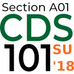

CDS 101 lecture slides (Summer 2018) 
====================================

[![Build Status][travis-ci-badge]][travis-ci-url]

Overview
--------

These are the R Markdown source files for my [CDS 101][cds-101-summer-2018] lecture slides used during the summer 2018 semester at [George Mason University][mason-site].
The R Markdown files are converted into [remark][remark-url] HTML5 slideshows via the [xaringan][xaringan-github] R package and presented directly from the web browser.
The slides are also available for download in the PDF format under the latest release tag.

Prerequisites
-------------

The following software and R packages are required if you want to convert the R Markdown documents into [remark][remark-url] slideshows yourself.

### Software

*   [R][r-lang-url] (>=3.4)

*   [RStudio][rstudio-url] (>=1.1.456), [preview release][rstudio-preview] recommended

*   (Windows) [Rtools][rtools-ucb-mirror]: match the Rtools version to the R version and perform a full install

*   (Mac) [Xcode Command Line Tools][xcode-url]: needed for compiling source code in certain R packages
    
    ```sh
    # To install Xcode Command Line Tools, open up a terminal window and run the following
    xcode-select --install
    ```
    
*   (Optional) [git][git-download-page]: needed to clone the repository as a new project in RStudio

### R packages

    broom      (>= 0.5.0)
    dplyr      (>= 0.7.6)
    forcats    (>= 0.3.0)
    ggplot2    (>= 3.0.0)
    gridExtra  (>= 2.3)
    infer      (>= 0.3.1)
    lubridate  (>= 1.7.4)
    modelr     (>= 0.1.2)
    purrr      (>= 0.2.5)
    readr      (>= 1.1.1)
    robotstxt  (>= 0.6.0)
    rvest      (>= 0.3.2)
    stringr    (>= 1.3.1)
    tidyr      (>= 0.8.1)
    tidyverse  (>= 1.2.1)
    xaringan   (>= 0.7)

See [Install](#install) for an easy way to install the above R packages.

Install
-------

Obtain a copy of this repo either by [cloning it as a new RStudio project][rstudio-git-explainer] or by downloading the zip archive.
Activate the project by clicking the file [`summer-2018-lecture-slides.Rproj`](./summer-2018-lecture-slides.Rproj) in the RStudio file browser.
Then, in an R console, type the following to install the necessary R packages:

```r
install.packages("remotes", repos = "https://cran.rstudio.com")
remotes::install_deps()
```

Usage
-----
    
The provided [Makefile](Makefile) can be run within RStudio and contains rules for automatically knitting every R Markdown file in this repository and saving the result to a `build/` directory.
To run the Makefile, use the keyboard shortcut <kbd>Ctrl</kbd>+<kbd>Alt</kbd>+<kbd>B</kbd> or click the **Build** tab in the upper-right window and then click the *Build All* button.
Once the build process completes, you will find the newly converted slideshows in a newly created folder called `build/`.

To view the slideshows, open the HTML files using your web browser.
I recommend using [Google Chrome][chrome-download] for this as it seems to provide the best rendering of these files.
Please note that these HTML files should not be moved to another location on your computer, otherwise they will not render correctly in your browser.

License
-------

[![Creative Commons License][cc-by-sa-4-img]][cc-by-sa-4]

Unless otherwise noted, the materials in this repository are licensed under a [Creative Commons Attribution-ShareAlike 4.0 International License][cc-by-sa-4].

[xcode-url]:             https://developer.apple.com/downloads/more
[cc-by-sa-4]:            http://creativecommons.org/licenses/by-sa/4.0/
[mason-site]:            https://gmu.edu
[r-lang-url]:            https://www.r-project.org/
[remark-url]:            https://github.com/gnab/remark
[rstudio-url]:           https://www.rstudio.com/products/rstudio/download/#download
[travis-ci-url]:         https://travis-ci.com/mason-cds-intro-comput-sci/summer-2018-lecture-slides
[cc-by-sa-4-img]:        https://i.creativecommons.org/l/by-sa/4.0/88x31.png
[chrome-download]:       https://www.google.com/chrome/
[rstudio-preview]:       https://www.rstudio.com/products/rstudio/download/preview/
[travis-ci-badge]:       https://travis-ci.com/mason-cds-intro-comput-sci/summer-2018-lecture-slides.svg?branch=master
[xaringan-github]:       https://github.com/yihui/xaringan
[git-download-page]:     https://git-scm.com/download
[rtools-ucb-mirror]:     https://cran.cnr.berkeley.edu/bin/windows/Rtools/
[cds-101-summer-2018]:   http://summer18.cds101.com
[rstudio-git-explainer]: http://happygitwithr.com/rstudio-git-github.html#clone-the-new-github-repository-to-your-computer-via-rstudio
