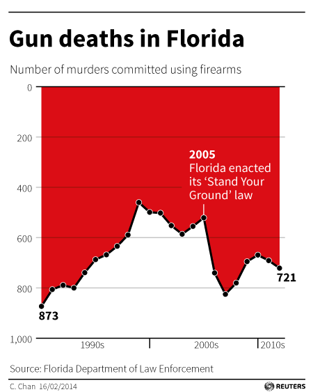
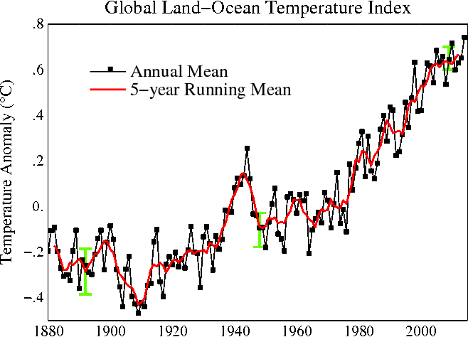

class: center, middle, title-slide

.upper-right[
```{r logo, eval = TRUE, echo = FALSE, out.width = "605px"}
knitr::include_graphics("../img/cds-101-a01-logo.png")
```
]

.lower-right[
```{r cc-by-sa, eval = TRUE, echo = FALSE, out.width = "88px"}
knitr::include_graphics("../img/cc-by-sa.png")
```

These slides are licensed under a [Creative Commons Attribution-ShareAlike 4.0 International License](http://creativecommons.org/licenses/by-sa/4.0/).
]

# Class 4: Introduction to data and visualization
.title-hline[
## May 24, 2018
]

---

class: middle, center, inverse

# General

```{r setup, include = FALSE}
# DO NOT ALTER THIS CHUNK
knitr::opts_chunk$set(echo = FALSE, eval = TRUE, fig.width = 5,
                      fig.asp = 0.618, out.width = "70%", dpi = 120,
                      fig.align = "center", cache = FALSE)
options(htmltools.dir.version = FALSE)
# Load required packages
suppressPackageStartupMessages(library(tidyverse, quietly = TRUE))
```

---

# Annoucements

.valign-slide[
*   Reading for next class: *R for Data Science* - chapter 3, section 3.1 through to the end of section 3.6
]

---

class: middle, center, inverse

# Data basics

---

# Data matrix

Data collected on students in a data science class on a variety of variables:

| Stu.     | sex      | intro_extra | $\cdots$ | dread    |
| -------- | -------- | ----------- | -------- | -------- |
| 1        | male     | extravert   | $\cdots$ | 3        |
| 2        | female   | extravert   | $\cdots$ | 2        |
| 3        | female   | extravert   | $\cdots$ | 4        |
| 4        | female   | extravert   | $\cdots$ | 2        |
| $\vdots$ | $\vdots$ | $\vdots$    | $\vdots$ | $\vdots$ |
| 21       | male     | extravert   | $\cdots$ | 3        |

---

# Types of variables

```{r types-of-variables}

```

---

# Types of variables

|    | sex | sleep | bedtime | countries | dread |
| --- | --- | --- | --- | --- | --- | --- |
| 1  | male | 5 | 12 – 2 | 13 | 3 |
| 2 | female | 7 | 10 – 12 | 7 | 2 |
| 3 | female | 5.5 | 12 – 2 | 1 | 4 |
| 4 | female | 7 | 12 – 2 |    | 2 |
| 5 | female | 3 | 12 – 2 | 1| 3 |
| 6 | female | 3 | 12 – 2 | 9 | 4 |

--

*   *sex:* categorical
--

*   *sleep:* numerical, continuous
--

*   *bedtime:* categorical, ordinal
--

*   *countries:* numerical, discrete
--

*   *dread:* categorical, ordinal (or numerical)

---

# Practice

.qa[
What type of variable is a telephone area code?

1.  numerical, continuous

2.  numerical, discrete

3.  categorical

4.  categorical, ordinal
]
--

.answer[categorical]

---

class: middle, center, inverse

# Relationships among variables

---

# Relationships among variables

.qa[Does there appear to be a relationship between GPA and number of hours students study per week?]

```{r gpa-study-hours}

```

--

.qa[Can you spot anything unusual about any of the data points?]

--
.answer[There is one student with GPA $>$ 4.0, this is likely a data error.]

---

class: middle, center, inverse

# Associated and independent variables

---

# Practice

.qa[Based on the following scatterplot, which of the following statements is correct about the head and skull lengths of possums?]

```{r possum-head-skull, out.width = "45%"}

```

1.  There is no relationship between head length and skull width, i.e. the variables are independent.
2.  Head length and skull width are positively associated.}
3.  Skull width and head length are negatively associated.
4.  A longer head causes the skull to be wider.
5.  A wider skull causes the head to be longer.
--

.answer[Head length and skull width are positively associated.]

---

# Associated vs. independent

*   When two variables show some connection with one another, they are called **associated** variables.

    *   Associated variables can also be called **dependent** variables and vice-versa.

*   If two variables are not associated, i.e. there is no evident connection between the two, then they are said to be **independent**.

---

class: middle, center, inverse

# Examining numerical data

---

# Dot plots

.valign-slide[
Useful for visualizing one numerical variable. Darker colors represent areas where there are more observations.

```{r gpa-dot-plot, echo = FALSE}

```

.qa[
How would you describe the distribution of GPAs in this data set?
Make sure to say something about the center, shape, and spread of the distribution.
]
]

---

# Dot plots & mean

.valign-slide[
```{r gpa-dot-plot-mean, echo = FALSE}
knitr::include_graphics("../img/gpa_dot_plot_mean.svg")
```

* The **mean**, also called the **average** (marked with a triangle in the above plot), is one way to measure the center of a **distribution** of data.

* The mean GPA is 3.59.
]

---

# Mean

.valign-slide.latex[
* The **sample mean**, denoted as $\mathbf{\bar{x}}$, can be calculated as
  $$\bar{x} = \frac{x_1 + x_2 + \dots + x_n}{n},$$
  where $x_1, x_2, \cdots, x_n$ represent the **n** observed values.

* The **population mean** is also computed the same way but is denoted as $\mathbf{\mu}$.
  It is often not possible to calculate $\mu$ since population data are rarely available.

* The sample mean is a **sample statistic**, and serves as a **point estimate** of the population mean.
  This estimate may not be perfect, but if the sample is good (representative of the population), it is usually a pretty good estimate. 
]

---

class: middle, center, inverse

# Histograms and shape

---

# Histograms &mdash; Extracurricular hours

* Histograms provide a view of the **data density**.
  Higher bars represent where the data are relatively more common.

* Histograms are especially convenient for describing the **shape** of the data distribution.

* The chosen **bin width** can alter the story the histogram is telling.

```{r extracurr-hrs-hist, echo = FALSE, out.width = "70%"}
knitr::include_graphics("../img/extracurr_hrs_hist.svg")
```

---

# Bin width

.qa[
Which one(s) of these histograms are useful? Which reveal too much about the data? Which hide too much?
]

.pull-left[
```{r extracurr-hrs-hist-binwidth-1, echo = FALSE, out.width = "90%", output = "markup"}
knitr::include_graphics("../img/extracurr_hrs_hist2.svg")
knitr::include_graphics("../img/extracurr_hrs_hist.svg")
```
]

.pull-right[
```{r extracurr-hrs-hist-binwidth-2, echo = FALSE, out.width = "90%"}
knitr::include_graphics("../img//extracurr_hrs_hist20.svg")
knitr::include_graphics("../img/extracurr_hrs_hist30.svg")
```
]

---

class: middle, center, inverse

# Data visualization as communication

---

# Why is data visualization important?

.quote-container[
> Nothing in science has any value to society if it is not communicated, and scientists are beginning to learn their social obligations.
.cite[Anne Roe, *The Making of a Scientist* (1953)]
]

--

.quote-container[
> If you cannot - in the long run - tell everyone what you have been doing, your doing has been worthless.
.cite[Erwin Schrodinger (Nobel Prize winner in physics)]
]

--

.quote-container[
> The greatest value of a picture is when it forces us to notice what we never expected to see.
.cite[John Tukey (Mathematician, recipient of National Medal of Science)]
]

--

.quote-container[
> Numbers have an important story to tell. They rely on you to give them a clear and convincing voice.
.cite[Stephen Few (Founder of [Perceptual Edge](https://www.perceptualedge.com), author of *Show Me the Numbers*)]
]

--

.quote-container[
> Visualizations act as a campfire around which we gather to tell stories.
.cite[Al Shalloway (Founder and CEO of [Net Objectives](http://www.netobjectives.com))]
]

---

# .font90[Effective presentations ↔ effective visuals]

```{r steve_jobs, out.height = "400px"}

```

.footnote[Source: [Digital Image](https://static6.businessinsider.com/image/52b86ad769bedd9b32759577-1200/steve-jobs-iphone.jpg), *AP* photo used on *Business Insider*, Accessed September 10, 2017, <http://www.businessinsider.com/the-first-iphone-2013-12>]

---

# .font90[Visualizations can lead to comprehension...]

```{r fallen_ww2, out.height = "400px"}
knitr::include_graphics("../img/fallen_of_ww2.png")
```

.footnote[Source: [The Fallen of World War II](http://www.fallen.io/ww2/)]

---

# ...or to confusion

```{r nytimes_movies, out.width = "600px"}

```

.footnote[Source: [The Ebb and Flow of Movies - Box Office Receipts 1986--2008 - Interactive Graphic - NYTimes.com](http://www.nytimes.com/interactive/2008/02/23/movies/20080223_REVENUE_GRAPHIC.html)]

---

# Poor visualizations may lead to tragedy

*   The *Challenger* disaster, January 28th, 1986

--

*   The Space Shuttle Challenger broke apart 73 seconds into flight, all seven crew members died

--

*   The rubber O-rings, which held the rockets together, had failed due to the low temperatures (below 30°F)

--

*   Engineers at Morton Thiokol, who supplied solid rocket motors to NASA, warned about this on January 27th, 1986 in a conference call

--

*   NASA and the managers at Morton Thiokol overruled their concerns, unpersuaded by the engineers

---

# .font90[The engineers presented tables like this one]

```{r o-rings_chart, out.width = "600px"}
knitr::include_graphics("../img/morton_thiokol_chart_o-rings.png")
```

.footnote[Source: Figure 2.18(a) in *Modern Data Science with R* by Benjamin Baumer, Daniel Kaplan, and Nicholas Horton]

---

# .font80[Edward Tufte's critique of the Challenger disaster]

Mathematician Edward Tufte issued a critique and argued that the data should have been presented this way:

```{r tufte-challenger, out.width = "750px"}
knitr::include_graphics("../img/tufte_challenger_scatterplot_recreation.png")
```

.footnote[Source: Figure 2.17 in *Modern Data Science with R* by Benjamin Baumer, Daniel Kaplan, and Nicholas Horton]

---

# .font80["Chartjunk" in Challenger Congressional Hearings]

This information was presented in Congressional Hearings about the incident in this format:

```{r challenger_congress, out.width = "450px"}

```

.footnote[Source: Figure 2.18(b) in *Modern Data Science with R* by Benjamin Baumer, Daniel Kaplan, and Nicholas Horton]

---

# *How to Lie with Statistics*

*   Book by Darrell Huff, published in 1954

--

*   Aside: The title is tongue-in-cheek and is usually misunderstood. The book is not about "fudging the numbers" with statistics.

--

*   Illustrates ways that visualizations can be manipulated such that they are misleading, but technically show accurate information

--

*   **General method:** Violate conventions and expectations

---

# .font90[Example 1: gun deaths in Florida over time]

*   Context: Florida passed a "Stand Your Ground" law in 2005

--

*   Advocates claimed it would reduce crime, opponents argued it would increase use of lethal force

--

*   If you wanted to use data to answer this question, and you came across this graphic published by the news organization Reuters, what would you conclude?

---

count: false

# .font90[Example 1: gun deaths in Florida over time]

```{r reuters_florida, out.width = "400px"}

```

---

# .font80[Example 2: average global temperature over time]

*   The political/editorial magazine National Review [tweeted the following visualization](https://twitter.com/NRO/status/676516015078039556) on December 14, 2015.
    The visualization [originates from a post](http://www.powerlineblog.com/archives/2015/10/the-only-global-warming-chart-you-need-from-now-on.php) on a political blog called Power Line.

```{r nro_powerline_temperatures, out.width = "700px"}
knitr::include_graphics("../img/nro_powerline_temperatures.jpg")
```

---

count: false

# .font80[Example 2: average global temperature over time]

*   Here's a conventional version of the same data:

```{r nasa_goddard_temperatures, out.height = "375px"}

```

.footnote[Source: [Nasa Goddard Institute for Space Studies](https://data.giss.nasa.gov/gistemp/graphs_v3/)]

---

# .font60[Side note: How do we have a record going back to the 1880s?]

.valign-slide[
Temperatures from the 1800s and onward were recorded using thermometers at various locations around the globe, and by the 1880s thermometers had become precise.
Systematic measurements began around the mid-1800s at various army posts, and in 1891 the National Weather Service was formed to continue the effort.
]

.footnote[Source: [National Oceanic and Atmospheric Administration, "How do we observe today's climate?"](https://www.climate.gov/maps-data/primer/measuring-climate)]

---

# .font80[Principles and ethics for scientific visualizations]

1.  Present your results transparently and honestly

--

2.  Show all data, including outliers, that are valid measurements

--

3.  Use graph layouts that show trends and lets readers easily read quantitative values

--

4.  Do not break conventions regarding scaling, axis orientation, the type of plot to use, etc.

--

5.  If you leave something out of a visualization, say so and justify it

--

6.  Strongly consider including your datasets and any scripts used to create figures with your reports or journal articles

---

# Credits

.valign-slide[
*   Examples from slides before **Data visualization as communication**, as well as the slides with the blue headers, were adapted from the Chapter 1 [OpenIntro Statistics Slides](https://github.com/OpenIntroOrg/openintro-statistics-slides) developed by Mine Cetinkaya-Rundel and made available under the [CC BY-SA 3.0 license](http://creativecommons.org/licenses/by-sa/3.0/us/).

*   Ideas and examples in the section **Data visualization as communication** were adapted from *Modern Data Science with R* by Benjamin Baumer, Daniel Kaplan, and Nicholas Horton, chapters 2 and 6.
]
