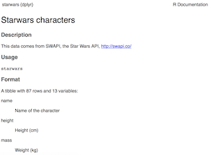

class: center, middle, title-slide

.upper-right[
```{r logo, echo = FALSE, out.width = "605px"}
knitr::include_graphics("../img/cds-101-a01-logo.png")
```
]

.lower-right[
```{r cc-by-sa, echo = FALSE, out.width = "88px"}
knitr::include_graphics("../img/cc-by-sa.png")
```

These slides are licensed under a [Creative Commons Attribution-ShareAlike 4.0 International License](http://creativecommons.org/licenses/by-sa/4.0/).
]

# Class 5: Introduction to data and visualization II
.title-hline[
## May 25, 2018
]

---

class: middle, center, inverse

# General

```{r setup, include = FALSE}
# DO NOT ALTER THIS CHUNK
source("../src/xaringan_setup.R")
# Load required packages
suppressPackageStartupMessages(library(tidyverse))
suppressPackageStartupMessages(library(gridExtra))
```

---

# Annoucements

.valign-slide[
* Course website updated: <http://summer18.cds101.com>

* Reading 4 from [R for Data Science](http://r4ds.had.co.nz/), questions due on May 28th by 5:00pm

  * [From chapter 3](http://r4ds.had.co.nz/data-visualisation.html): section 3.7 through to the end of section 3.10

* Reading 5 from [R for Data Science](http://r4ds.had.co.nz/), questions due on May 29th by 9:00am

  * All of [chapter 4](http://r4ds.had.co.nz/workflow-basics.html) (short)

  * All of [chapter 5](http://r4ds.had.co.nz/transform.html)

* [Visualization mini-assignment](http://summer18.cds101.com/assignments/visualization-mini-assignment/) posted, due May 28th @ 11:59pm

* If you cannot access [RStudio Server](https://rstudio.cos.gmu.edu) (<https://rstudio.cos.gmu.edu>) over the weekend, use [RStudio Cloud](https://rstudio.cloud) (<https://rstudio.cloud>) instead
]

---

class: middle, center, inverse

# Data visualization as exploration

---

# Basic terms

## Variable

A quantity, quality, or property that you can measure.

## Value

The state of a variable when you measure it.
The value of a variable may change from measurement to measurement.

## Observation

A set of measurements made under similar conditions (you usually make all of the measurements in an observation at the same time and on the same object).
An observation contains several values, each associated with a different variable.

---

count: false

# Basic terms

## Tabular data (rectangular data)

A set of values, each associated with a variable and an observation.

---

# Kinds of data

## Numerical

Data that is a number, either an *integer* (whole numbers) or a *float* (real numbers).
This kind of data is collected from device sensors, through counting and polling, outputs of computational simulations, etc.

## Categorical

Groups observations into a set.
Categories can be in text form (*strings* or *characters*), for example brand names for a certain kind of product, or numerical, for example labeling city districts by numbers.

## Textual

Plain text that is too varied to be treated as a category.
Some examples can be full names, the text of a literary work, tweets, etc.

---

class: middle, center, inverse

# How to describe visualizations

---

# A taxonomy for data graphics

.valign-slide[
* We can break visualizations down into four basic elements:

  * Visual cues
  
  * Coordinate system
  
  * Scale
  
  * Context
]

---

# Visual cues

.valign-slide[
*   These are the building blocks of any given visualization.

*   Identify 9 separate visual cues.
]

---

# Cues 1&ndash;9

.valign-slide[
1. **Position** (numerical) where in relation to other things?

2. **Length** (numerical) how big (in one dimension)?

3. **Angle** (numerical) how wide? parallel to something else?

4. **Direction** (numerical) at what slope? In a time series, going up or down?

5. **Shape** (categorical) belonging to which group?

6. **Area** (numerical) how big (in two dimensions)?

7. **Volume** (numerical) how big (in three dimensions)?

8. **Shade** (either) to what extent? how severly?

9. **Color** (either) to what extent? how severly? Beware of red/green color blindness.
]

---

# Coordinate systems

.valign-slide[
1. **Cartesian** This is the familiar (*x*, *y*)-rectangular coordinate system with two perpendicular axes

2. **Polar**: The radial analog of the Cartesian system with points identified by their radius *ρ* and angle *θ*

3. **Geographic**: Locations on the curved surface of the Earth, but represented in a flat two-dimensional plane
]

---

# Scale

.valign-slide[
1. **Numeric**: A numeric quantity is most commonly set on a *linear*, *logarithmic*, or *percentage* scale.

2. **Categorical**: A categorical variable may have no ordering or it may be *ordinal* (position in a series).

3. **Time**: A numeric quantity with special properties.
    Because of the calendar, it can be specified using a series of units (year, month, day).
    It can also be considered cyclically (years reset back to January, a spring oscillating around a central position).
]

---

# Context

.valign-slide[
* Annotations and labels that draw attention to specific parts of a visualization.

  * Titles, subtitles
  
  * Axes labels that depict scale (tick mark labels) and indiciate the variable
  
  * Reference points or lines
  
  * Other markups such as arrows, textboxes, and so on (it's possible to overdo these)
]

---

# Example plot

.center[How many of the previous elements can you identify in this plot?]

```{r mpg-example-identify, eval = TRUE, echo = FALSE, out.width = "90%", fig.width = 6}
ggplot(data = mpg) +
  geom_point(mapping = aes(x = displ, y = hwy, color = class)) +
  labs(title = "Engine size and gas mileage on the highway",
       x = "Engine size",
       y = "Mileage on highway") +
  theme(plot.title = element_text(size = rel(1.5)),
        axis.title = element_text(size = rel(1.1)),
        axis.text = element_text(size = rel(0.9)),
        strip.text = element_text(size = rel(0.9)))
```

---

class: middle, center, inverse

# Data visualization with `ggplot2`

---

# Structure of R commands

Functions in R are often verbs, and then in parantheses are the arguments for those functions.

```r
verb(what-you-want-to-apply-verb-to, other-arguments)
```

For example:

--

```r
glimpse(mpg)            # Glimpse into the mpg dataset
```

--

```r
ggplot(mpg) +                          # Create plot window; plot
                                       #     variables found in mpg
                                       #     dataset
  geom_point(aes(x = displ, y = hwy))  # Create scatterplot with displ
                                       #     variable on x-axis, hwy
                                       #     variable on y-axis
```

---

# Structure of `ggplot2` commands

To use ggplot2 functions, load `tidyverse`:

```r
library(tidyverse)
```

--

In ggplot2 the structure of the code for plots can often be summarized as

```r
ggplot +
  geom_word
```

--

or, more precisely

--

```r
ggplot(data = [dataset]) +
   geom_word(mapping = aes(x = [x-variable], y = [y-variable])) +
   other options
```

--

`Geoms`, short for geometric objects, describe the type of plot you will produce.

---

# About ggplot2

.valign-slide[
*   ggplot2 is the name of the package

*   The `gg` in "ggplot2" stands for Grammar of Graphics

*   Inspired by the book **Grammar of Graphics** by Lee Wilkinson

*   `ggplot()` is the main function in ggplot2
]

---

class: middle, center, inverse

# Visualizing Star Wars

---

# Star Wars data

Loading `tidyverse` also loads a dataset called `starwars` into your RStudio environment:

.code70[
```{r star-wars-table-1, message = FALSE, eval = TRUE, echo = TRUE}
library(tidyverse)
starwars
```
]

---

# Dataset terminology

.qa[
What does each row represent? What does each column represent?
]

```{r star-wars-table-2, message = FALSE, eval = TRUE, echo = FALSE}
starwars
```

---

# Luke Skywalker

.valign-slide[
```{r luke-skywalker-data, height = "100%", echo = FALSE}
knitr::include_graphics("../img/luke-skywalker.png")
```
]

---

# What's in the Star Wars data?

Take a `glimpse` at the data:

```{r glimpse-star-wars, echo = TRUE}
glimpse(starwars)
```

---

# What's in the Star Wars data?

.pull-left[
Run the following **in the Console** to view the help

```r
?starwars
```
]

.pull-right[
```{r starwars-helpdata, out.width = "100%", echo = FALSE}

```
]

--

.qa[
How many rows and columns does this dataset have? 

What does each row represent? What does each column represent?
]

--

.qa[
Make a prediction: What relationship do you expect to see between height and mass?
]

---

class: middle, center, inverse

# Scatterplots

---

# Mass vs. height (`geom_point()`)

Not all characters have height and mass information (hence 28 of them not plotted)

```{r starwars-height-mass-1, echo = TRUE}
ggplot(data = starwars) +
  geom_point(mapping = aes(x = height, y = mass))
```

---

# Mass vs. height

.qa[
How would you describe this relationship? What other variables would help us understand data points that don't follow the overall trend?
]

```{r starwars-height-mass-2, echo=FALSE}
ggplot(data = starwars) +
  geom_point(mapping=aes(x = height, y = mass))
```

---

# Mass vs. height

.qa[
Who is the not so tall but really massive character?
]

```r
ggplot(data = starwars) +
  geom_point(mapping = aes(x = height, y = mass))
```

.pull-left[
```{r starwars-height-mass-3, out.width = "100%", echo = FALSE}
ggplot(data = starwars) +
  geom_point(mapping = aes(x = height, y = mass))
```
]

--

.pull-right[
```{r jabba-the-hut, out.width = "70%", echo = FALSE}

```
]

---

# Additional variables

.valign-slide[
Can display additional variables with

*   aesthetics (like shape, colour, size), or

*   faceting (small multiples displaying different subsets)
]

---

class: middle, center, inverse

# Aesthetics

---

# Aesthetics options

.valign-slide[
Visual characteristics of plotting characters that can be **mapped to data** are

* `color`

* `size`

* `shape`

* `alpha` (transparency)
]

---

# Mass vs. height + gender

```{r starwars-mass-height-gender, echo = TRUE, out.width = "80%"}
ggplot(data = starwars) +
  geom_point(mapping = aes(x = height, y = mass, color = gender))
```

---

# Aesthetics summary

* Continuous variable are measured on a continuous scale

* Discrete variables are measured (or often counted) on a discrete scale

| aesthetics    | discrete                 | continuous                              |
| ------------- | ------------------------ | --------------------------------------- |
| color         | rainbow of colors        | gradient                                |
| size          | discrete steps           | linear mapping between radius and value |
| shape         | different shape for each | shouldn't (and doesn't) work            |

---

class: middle, center, inverse

# Faceting

---

# Faceting options

.valign-slide[
* Smaller plots that display different subsets of the data

* Useful for exploring conditional relationships and large data
]

---

# Mass vs. height by gender

```{r starwars-mass-height-gender-facet-1, echo = TRUE, out.width = "80%"}
ggplot(data = starwars) +
  geom_point(mapping = aes(x = height, y = mass)) +
  facet_grid(. ~ gender)
```

---

# Many ways to facet

.valign-slide[
In the next few examples, think about what each plot displays.
Think about how the code relates to the output.
]

---

# Many ways to facet

```{r starwars-mass-height-gender-facet-2, echo = TRUE, out.width = "80%"}
ggplot(data = starwars) +
  geom_point(mapping = aes(x = height, y = mass)) +
  facet_grid(gender ~ .)
```

---

# Many ways to facet

```{r starwars-mass-height-gender-facet-3, echo = TRUE, out.width = "80%"}
ggplot(data = starwars) +
  geom_point(mapping = aes(x = height, y = mass)) +
  facet_grid(. ~ gender)
```

---

# Many ways to facet

```{r starwars-mass-height-gender-facet-4, echo = TRUE, out.width = "80%"}
ggplot(data = starwars) +
  geom_point(mapping = aes(x = height, y = mass)) +
  facet_wrap(~ eye_color)
```

---

# Facet summary

.valign-slide[
*   `facet_grid()`: 2d grid, rows ~ cols, . for no split

*   `facet_wrap()`: 1d ribbon wrapped into 2d
]

---

class: middle, center, inverse

# Other geoms

---

# Height vs. mass, take 2

.qa[
How are these plots similar? How are they different?
]

--

```{r starwars-point-vs-smooth, echo = FALSE, out.width = "90%"}
p1 <- ggplot(starwars) +
  geom_point(aes(x = height, y = mass))

p2 <- ggplot(starwars) +
  geom_smooth(aes(x = height, y = mass))

grid.arrange(p1, p2, ncol = 2)
```

---

# `geom_smooth`

To plot a smooth curve, use `geom_smooth()`

```{r starwars-height-mass-smooth, echo = TRUE, out.width = "80%"}
ggplot(data = starwars) +
  geom_smooth(mapping = aes(x = height, y = mass))
```

---

# .font80[Describing shapes of numerical distributions]

.valign-slide[
* shape:

  * skewness: right-skewed, left-skewed, symmetric (skew is to the side of the longer tail)

  * modality: unimodal, bimodal, multimodal, uniform

* center: mean (`mean`), median (`median`), mode (not always useful)

* spead: range (`range`), standard deviation (`sd`), inter-quartile range (`IQR`)

* unusual observations
]

---

# Histograms

For numerical variables

```{r starwars-histogram, echo = TRUE, out.width = "80%"}
ggplot(starwars) +
  geom_histogram(mapping = aes(x = height), binwidth = 10)
```

---

# Bar plots

For categorical variables

```{r starwars-bar-plot, echo = TRUE, out.width = "80%"}
ggplot(starwars) +
  geom_bar(mapping = aes(x = gender))
```

---

# Credits

.valign-slide[
These slides were adapted from the following sources:

*   Ideas and examples in the section **How to describe visualizations** were adapted from *Modern Data Science with R* by Benjamin Baumer, Daniel Kaplan, and Nicholas Horton, chapter 2.

*   Ideas, examples and descriptions from section **Data visualization with .monospace[ggplot2]** onward were adapted from the [Fundamentals of data & data visualization](http://www2.stat.duke.edu/courses/Fall17/sta112.01/slides/03-deck.html) slides developed by Mine Çetinkaya-Rundel and made available under the [CC BY license](http://creativecommons.org/licenses/by-sa/4.0/us/).
]
