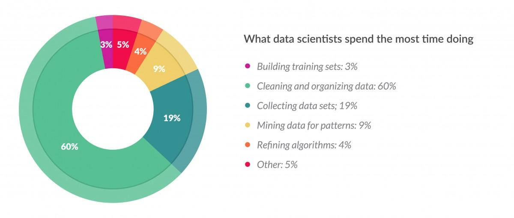
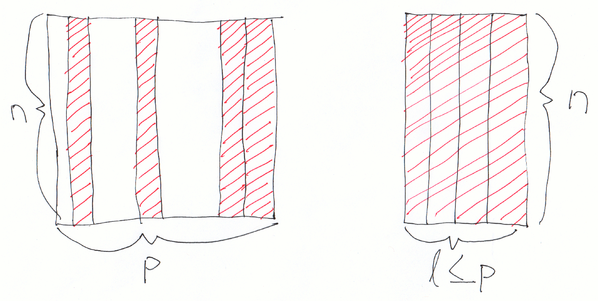
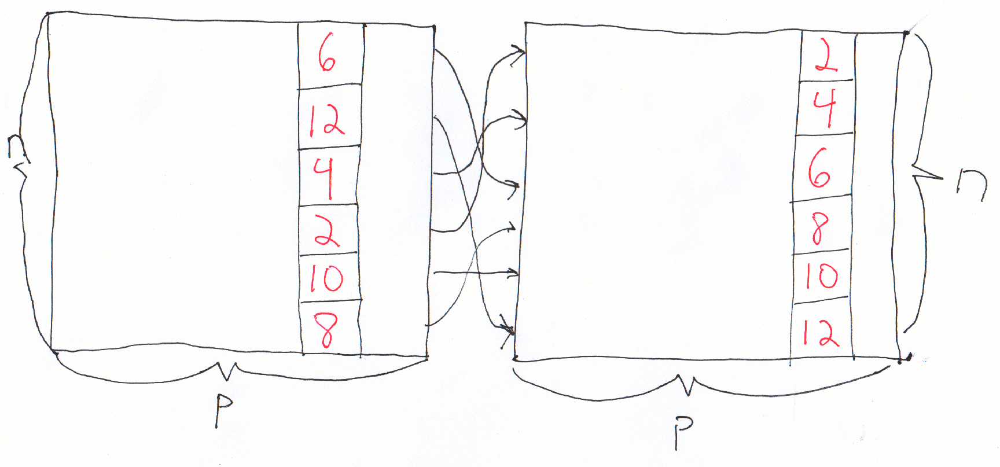
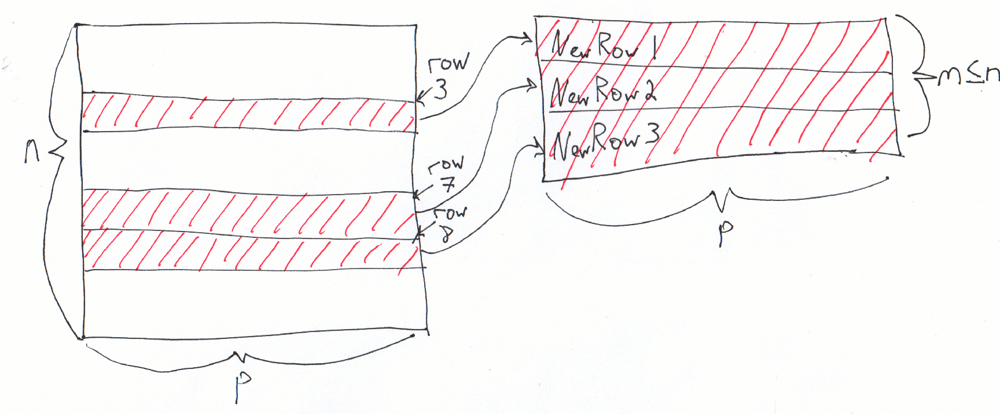
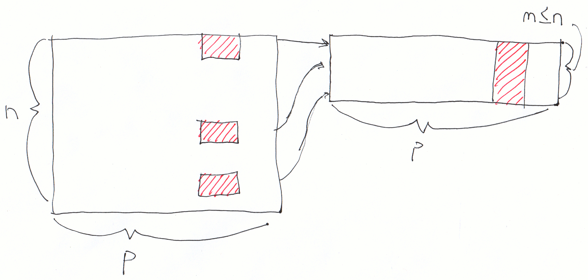

class: center, middle, title-slide

.upper-right[
```{r logo, echo = FALSE, out.width = "605px"}
knitr::include_graphics("../img/cds-101-a01-logo.png")
```
]

.lower-right[
```{r cc-by-sa, echo = FALSE, out.width = "88px"}
knitr::include_graphics("../img/cc-by-sa.png")
```

These slides are licensed under a [Creative Commons Attribution-ShareAlike 4.0 International License](http://creativecommons.org/licenses/by-sa/4.0/).
]

# Class 6: Data wrangling I
.title-hline[
## May 29, 2018
]

---

class: middle, center, inverse

# General

```{r setup, include = FALSE}
# DO NOT ALTER THIS CHUNK
source("../src/xaringan_setup.R")
# Load required packages
suppressPackageStartupMessages(library(tidyverse))
suppressPackageStartupMessages(library(lubridate))
```

---

# Annoucements

.valign-slide[
* Homework 1 due tomorrow by 11:59pm: <http://summer18.cds101.com/assignments/homework-1/>

* Reading 6 from [R for Data Science](http://r4ds.had.co.nz/), questions due on May 30th by 9:00am

  * All of [chapter 10](http://r4ds.had.co.nz/tibbles.html)

  * From [chapter 11](http://r4ds.had.co.nz/data-import.html): sections 11.1, 11.2, 11.4.2, and 11.5
]

---

class: middle, center, inverse

# What is data wrangling?

---

# The word "wrangle"

**wrangle**
.quote-container[
> verb
> 
> to tend or round up (cattle, horses, or other livestock).
> .cite[[dictionary.com](http://www.dictionary.com/browse/wrangle)]
]

--

* So, by analogy, "wrangling data" means to collect, clean, and organize digital information (tend and round up)

--

* Also encompasses the act of transforming data as a processing step to facilitate analysis

--

* Informal word, but data scientists will understand what you mean if you use it

---

count: false

# The word "wrangle"

```{r literal-data-wrangling, out.width = "100%", echo = FALSE}

```

.footnote[
Source: [Digital image of a cowboy wrangling data](http://i2.wp.com/rocketsci.azurewebsites.net/wp-content/uploads/2015/07/data-wrangling-1.jpg), Digital image on *likelihoodlog.com*, accessed September 20, 2017, <http://www.likelihoodlog.com/?p=1151>
]

---

# `ggplot2` needs clean/tidy datasets

* Datasets such as `mpg` or `rail_trail` (Assignment 1) are small and nicely organized

--

* It would be nice if all datasets were like this! ...but they're the exceptions to the rule

--

* Most raw datasets need cleaning, and this is where data scientists will spend **most** of their time

```{r data-science-time-estimates, out.width="65%", echo = FALSE}

```

.footnote[
Source: [Cleaning Big Data: Most Time-Consuming, Least Enjoyable Data Science Task, Survey Says](https://blogs-images.forbes.com/gilpress/files/2016/03/Time-1200x511.jpg), Digital image on *forbes.com*, accessed September 20, 2017, <https://www.forbes.com/sites/gilpress/2016/03/23/data-preparation-most-time-consuming-least-enjoyable-data-science-task-survey-says/>
]

---

# The "data wrangling" pipeline

```{r r4ds-data-wrangling-diagram-1, echo = FALSE}
knitr::include_graphics("../img/r4ds_data_wrangling.png")
```

--

* **import** → obtain data and get it into R

--

* **tidy** → reshape rows and columns to follow the [Tidy data rules](http://r4ds.had.co.nz/tidy-data.html)

--

* **transform** → cleaning the dataset (not the same as tidying) as well as "slicing and dicing" the dataset for exploration and analysis.

---

count: false

# The "data wrangling" pipeline

```{r r4ds-data-wrangling-diagram-2, echo = FALSE}
knitr::include_graphics("../img/r4ds_data_wrangling.png")
```

* .lightgray[**import** → obtain data and get it into R]

* .lightgray[**tidy** → reshape rows and columns to follow the] <a class="lightgray" href="http://r4ds.had.co.nz/tidy-data.html">Tidy data rules</a>

* .lightgray[**transform** → cleaning the dataset (not the same as tidying)] .red[as well as "slicing and dicing" the dataset for exploration and analysis.]

---

class: middle, center, inverse

# Data wrangling in R

---

# A few bits of R history

.valign-slide[
* The first stable version of R, v1.0.0, was released on February 29, 2000.

* R itself is an implementation of the [S programming language][s-lang-wiki], which was designed at Bell Laboratories in the mid-1970s.

* *Base R* was built for statisticians and for doing data analysis, but not necessarily for modern Data Science

* It's age and legacy brings along old implementations of data structures and abbreviated function (commands) names
]

.footnote[
Source: David Smith, *[Over 16 years of R project history](http://blog.revolutionanalytics.com/2016/03/16-years-of-r-history.html)*, [Revolutions blog](http://blog.revolutionanalytics.com), last updated on March 4, 2016, accessed September 20, 2017, <http://blog.revolutionanalytics.com/2016/03/16-years-of-r-history.html>
]

---

# Modernizing R with `tidyverse`

.valign-slide[
* Over the last 3 years, chief scientist at RStudio, Hadley Wickham, has brought R into the modern era with the `tidyverse`.

.quote-container[
> The tidyverse is an opinionated collection of R packages designed for data science.
> All packages share an underlying philosophy and common APIs.
.cite[[Front page of the Tidyverse website](https://www.tidyverse.org/)]
]

* In practice, this meant reducing everything to a small, core set of commands that all behave in a similar way.
]

---

# Core `tidyverse`

.valign-slide[
* `ggplot2`: ggplot2 is a system for declaratively creating graphics, based on The Grammar of Graphics. You provide the data, tell ggplot2 how to map variables to aesthetics, what graphical primitives to use, and it takes care of the details. 

* `dplyr`: dplyr provides a grammar of data manipulation, providing a consistent set of verbs that solve the most common data manipulation challenges.

* `tidyr`: tidyr provides a set of functions that help you get to tidy data. Tidy data is data with a consistent form: in brief, every variable goes in a column, and every column is a variable.
]

.footnote[
Source: Tidyverse packages, *tidyverse.com*, accessed on September 20, 2017, <https://www.tidyverse.org/packages/>
]

---

count: false

# Core `tidyverse`

.valign-slide[
* `readr`: readr provides a fast and friendly way to read rectangular data (like csv, tsv, and fwf). It is designed to flexibly parse many types of data found in the wild, while still cleanly failing when data unexpectedly changes.

* `purrr`: purrr enhances R's functional programming (FP) toolkit by providing a complete and consistent set of tools for working with functions and vectors. Once you master the basic concepts, purrr allows you to replace many for loops with code that is easier to write and more expressive.

* `tibble`: tibble is a modern re-imaginging of the data frame, keeping what time has proven to be effective, and throwing out what it has not. Tibbles are data.frames that are lazy and surly: they do less and complain more forcing you to confront problems earlier, typically leading to cleaner, more expressive code.
]

.footnote[
Source: Tidyverse packages, *tidyverse.com*, accessed on September 20, 2017, <https://www.tidyverse.org/packages/>
]

---

class: middle, center, inverse

# `dplyr` package

---

# Get copy of `dplyr` demo repository

.valign-slide[
* In Slack, go to su18-a01-activities channel

* Obtain a copy of the **dplyr demo** repository

* Load in RStudio, and follow along in demos
]

---

# `select()`

.valign-slide[
```{r select-schematic, out.width = "100%", echo = FALSE}

```
]

---

# `select()` demo

.vhalign-slide[
Follow along in RStudio
]

---

# `%>%` aside

Instead of this:

```r
select(presidential, name, party)
```

We write this:

```r
presidential %>%  
  select(name, party)
```

* Show the order of transformations

* Useful when we have to chain together many transformations!

---

# `arrange()`

.vhalign-slide[
```{r arrange-schematic, out.width = "100%", echo = FALSE}

```
]

---

# `arrange()` demo

.vhalign-slide[
Follow along in RStudio
]

---

# `slice()`

.vhalign-slide[
```{r slice-schematic, out.width = "100%", echo = FALSE}

```
]

---

# `slice()` demo

.vhalign-slide[
Follow along in RStudio
]

---

# `filter()`

.vhalign-slide[
```{r filter-schematic, out.width = "100%", echo = FALSE}

```
]

---

# Comparisons

.valign-slide[
Simple comparisons can be made using the following symbols:

* `>`: greater than

* `>=`: greater than or equal to

* `<`: less than

* `<=`: less than or equal to

* `!=`: not equal

* `==`: equal
]

---

# Logical operators

.vhalign-slide[
```{r r4ds-logical-operators, out.width = "100%", echo = FALSE}
knitr::include_graphics("../img/r4ds_logical_operators.png")
```
]

.footnote[
Source: [Digital image of logical operations](http://r4ds.had.co.nz/diagrams/transform-logical.png), *R for Data Science website*, accessed September 20, 2017, <http://r4ds.had.co.nz/transform.html#logical-operators>
]

---

# `filter()` demo

.vhalign-slide[
Follow along in RStudio
]

---

# Credits

.valign-slide[
These slides are based on the following sources:

*   Ideas and examples for the **dplyr demos** adapted from *Modern Data Science with R* by Benjamin Baumer, Daniel Kaplan, and Nicholas Horton, chapter 4.
]

[s-lang-wiki]: https://en.wikipedia.org/wiki/S_(programming_language)

