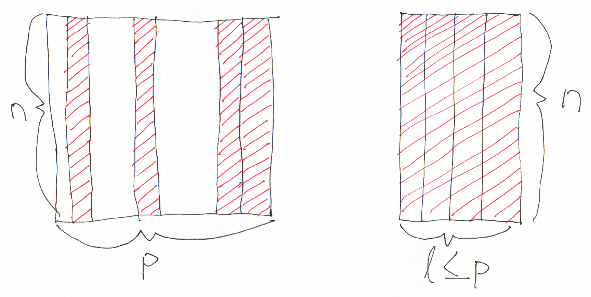
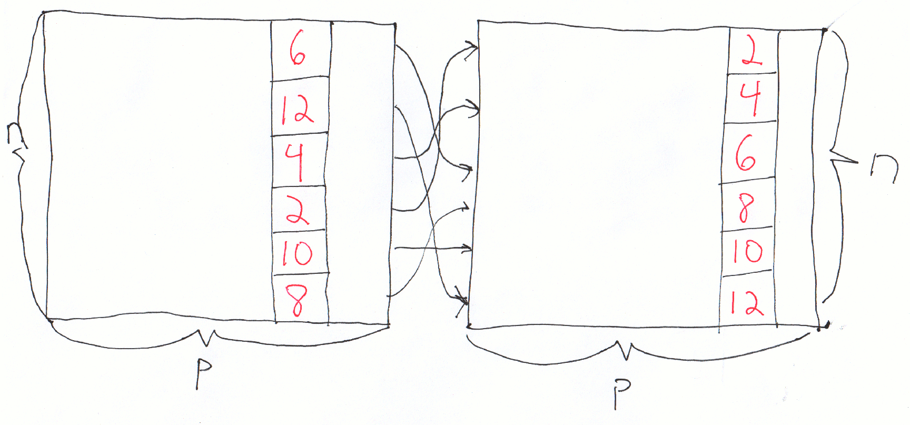
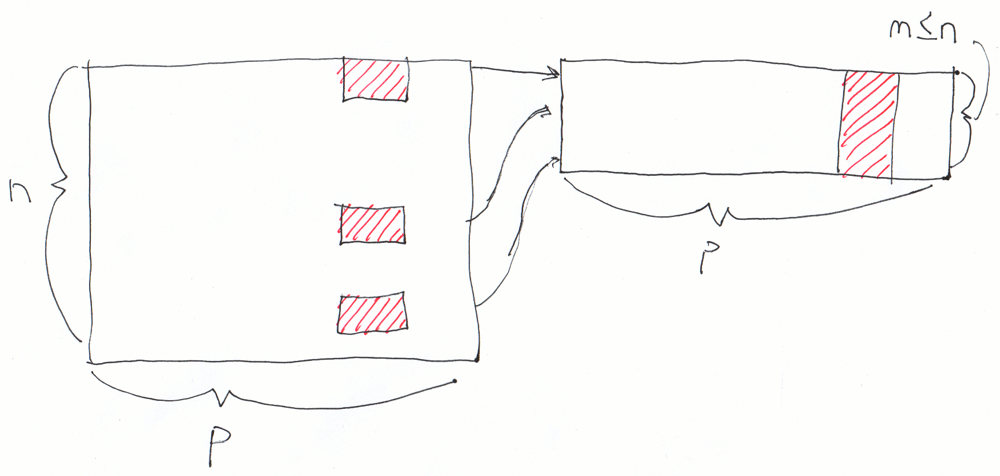

class: center, middle, title-slide

.upper-right[
```{r logo, echo = FALSE, out.width = "605px"}
knitr::include_graphics("../img/cds-101-a01-logo.png")
```
]

.lower-right[
```{r cc-by-sa, echo = FALSE, out.width = "88px"}
knitr::include_graphics("../img/cc-by-sa.png")
```

These slides are licensed under a [Creative Commons Attribution-ShareAlike 4.0 International License](http://creativecommons.org/licenses/by-sa/4.0/).
]

# Class 7: Data wrangling II
.title-hline[
## May 30, 2018
]

---

class: middle, center, inverse

# General

```{r setup, include = FALSE}
# DO NOT ALTER THIS CHUNK
source("../src/xaringan_setup.R")
# Load required packages
suppressPackageStartupMessages(library(tidyverse))
suppressPackageStartupMessages(library(lubridate))
```

---

# Annoucements

.valign-slide[
* Homework 1 due tonight by 11:59pm: <http://summer18.cds101.com/assignments/homework-1/>

* Reading 7: *Representing distributions* will be posted on website this afternoon
]

---

class: middle, center, inverse

# `dplyr` package (continued)

---

# Get copy of `dplyr` demo repository

.valign-slide[
* Open RStudio and reload your **dplyr demo** repository from last class

* If you need to re-clone, find the link to Github repository in the Slack channel `su18-a01-activities`

* Follow along in the demos
]

---

layout: true

# `dplyr` so far

.pull-left[
In the previous class, we reviewed the following `dplyr` commands
]

---

count: false

.pull-right[
* `select()`
]

.bottom-image[
```{r select-schematic, out.height = "300px", out.width = NULL, echo = FALSE}

```
]

---

count: false

.pull-right[
* `select()`

* `arrange()`
]

.bottom-image[
```{r arrange-schematic, out.height = "300px", out.width = NULL, echo = FALSE}

```
]

---

count: false

.pull-right[
* `select()`

* `arrange()`

* `slice()`
]

.bottom-image[
```{r slice-schematic, out.height = "300px", out.width = NULL, echo = FALSE}
knitr::include_graphics("../img/slice_schematic.png")
```
]

---

count: false

.pull-right[
* `select()`

* `arrange()`

* `slice()`

* `filter()`
]

.bottom-image[
```{r filter-schematic, out.height = "300px", out.width = NULL, echo = FALSE}

```
]

---

layout: false

# Use comparisons for filtering

.valign-slide[
* `>`: greater than

* `>=`: greater than or equal to

* `<`: less than

* `<=`: less than or equal to

* `!=`: not equal

* `==`: equal
]

---

# Logical operators

.vhalign-slide[
```{r r4ds-logical-operators, out.width = "100%", echo = FALSE}
knitr::include_graphics("../img/r4ds_logical_operators.png")
```
]

.footnote[
Source: [Digital image of logical operations](http://r4ds.had.co.nz/diagrams/transform-logical.png), *R for Data Science website*, accessed September 20, 2017, <http://r4ds.had.co.nz/transform.html#logical-operators>
]

---

# `mutate()`

.vhalign-slide[
```{r mutate-schematic, out.width = "100%", echo = FALSE}
knitr::include_graphics("../img/mutate_schematic.png")
```
]

---

# Using `mutate()`

.valign-slide[
* Many different operators and functions can be used with `mutate()`

* **Arithmetic operators:** `+`, `-`, `*`, `/`, `^`

* **Modular arithmetic**

  * `%/%`: integer division
    
  * `%%`: remainder
    
* **Logs:** `log()`

* **Logical comparisons:** `<`, `<=`, `>`, `>=`, `!=`
]

---

# `mutate()` demo

.vhalign-slide[
Follow along in RStudio
]

---

# `group_by()` and `summarize()`

.vhalign-slide[
```{r summarize-schematic, out.width = "100%", echo = FALSE}

```
]

---

# Using `summarize()`

.valign-slide[
* `n()`: Counts number of rows in a group

* `sum()`: For numerical variables, sums rows within a group

* **statistical**: `mean()`, `median()`, `sd()`, `min()`, `max()`

* Counts and proportions of logical values: `sum(x > 10)`, `mean(y == 0)`
]

---

# `group_by()` and `summarize()` demo

.vhalign-slide[
Follow along in RStudio
]

---

# Other helpful `dplyr` verbs

.valign-slide[
* `transmute()`: Like `mutate()`, except the transformed output is placed in a new data frame

* `pull()`: Extract column into the base R `vector` data type

* `rename()`: Convenient way to change the name of a variable (column)

* `distinct()`: Finds unique rows in the dataset

* `count()`: Group by category and count the number of group members
]

---

# `transmute()` example

.valign-slide[
```{r transmute-demo, echo = TRUE, eval = TRUE}
presidential %>%
  transmute(term_length = interval(start, end) / dyears(1))
```

]

---

# `pull()` example

.valign-slide[
```{r pull-demo, echo = TRUE, eval = TRUE}
presidential %>%
  pull(name)
```
]

---

# `rename()` example

.valign-slide[
```{r rename-demo, echo = TRUE, eval = TRUE}
presidential %>%
  rename(term_begin = start, term_end = end)
```
]

---

# `distinct()` example

.valign-slide[
```{r distinct-demo, echo = TRUE, eval = TRUE}
presidential %>%
  distinct(name)
```

]

---

# `count()` example

.valign-slide[
```{r count-demo, echo = TRUE, eval = TRUE}
presidential %>%
  count(party)
```
]

---

class: middle, center, inverse

# Practicing with real data: Chicago Towed Vehicles dataset

---

# Chicago Towing Data

* US cities are posting data online for citizens to download and analyze

--

* Chicago posts Towed Vehicle information over the past 90 days that is a good dataset to practice our `dplyr` skills on

--

* Link (also posted in Slack): <https://data.cityofchicago.org/Transportation/Towed-Vehicles/ygr5-vcbg/>

* Follow along to see how to import this dataset into RStudio and create a compressed version of it

---

# Credits

.valign-slide[
These slides are based on the following sources:

*   Ideas and examples for the **dplyr demos** adapted from *Modern Data Science with R* by Benjamin Baumer, Daniel Kaplan, and Nicholas Horton, chapter 4.
]
