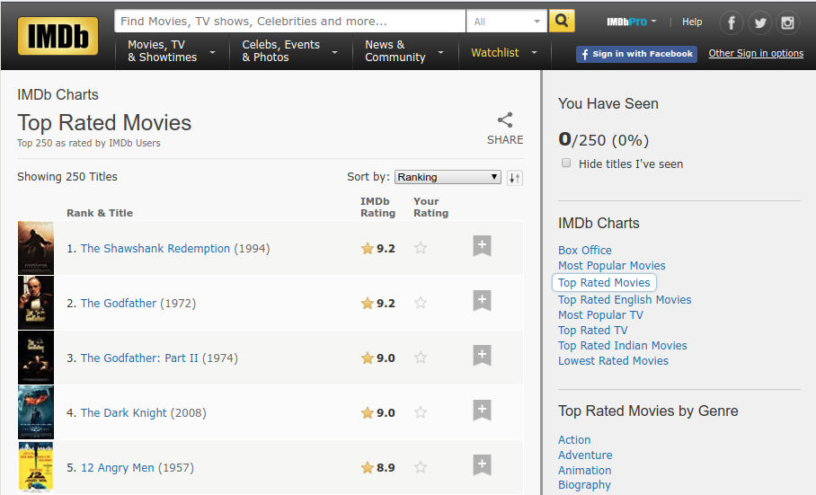

class: center, middle, title-slide

.upper-right[
```{r logo, echo = FALSE, out.width = "605px"}
knitr::include_graphics("../img/cds-101-a01-logo.png")
```
]

.lower-right[
```{r cc-by-sa, echo = FALSE, out.width = "88px"}
knitr::include_graphics("../img/cc-by-sa.png")
```

These slides are licensed under a [Creative Commons Attribution-ShareAlike 4.0 International License](http://creativecommons.org/licenses/by-sa/4.0/).
]

# Class 12: Web Scraping
.title-hline[
## June 6, 2018
]

---

class: middle, center, inverse

# General

```{r setup, include = FALSE}
# DO NOT ALTER THIS CHUNK
source("../src/xaringan_setup.R")
# Load required packages
suppressPackageStartupMessages(library(tidyverse))
suppressPackageStartupMessages(library(rvest))
```

---

# Announcements

.valign-slide[
* Homework 2 due tonight @ 11:59pm: <http://summer18.cds101.com/assignments/homework-2/>

* Complete Reading 10 on web scraping and submit questions by 9:00am on Friday, June 8th

* Homework 3 on web scraping to be posted soon, will be due by 11:59pm on Tuesday, June 12th

* Be prepared to share and discuss your proposed questions for the Midterm Project on Friday, June 8th
]

---

class: middle, center, inverse

# Scraping the web

---

# Scraping the web: what? why?

* Increasing amount of data is available on the web.

--

* These data are provided in an unstructured format: you can always copy & paste, but it's time-consuming and prone to errors.

--

* Web scraping is the process of extracting this information automatically and transform it into a structured dataset.

--

* Two different scenarios:

--

  * Screen scraping: extract data from source code of website, with html parser (easy) or regular expression matching (less easy).

--

  * Web APIs (application programming interface): website offers a set of structured http requests that return JSON or XML files.

--

* Why R? It includes all tools necessary to do web scraping, familiarity, direct analysis of data... But python, perl, java, and javascript are also efficient tools.

---

class: center, middle, inverse

# Web Scraping with rvest

---

# Hypertext Markup Language

Most of the data on the web is still largely available as HTML - while it is structured (hierarchical / tree based) it often is not available in a form useful for analysis (flat / tidy).

--

```html
<html>
  <head>
    <title>This is a title</title>
  </head>
  <body>
    <p align="center">Hello world!</p>
  </body>
</html>
```

---

# rvest

`rvest` is a package from Hadley Wickham that makes basic processing and manipulation of HTML data straight forward.

--

.h4[Core functions:]

--

* `read_html` - read HTML data from a url or character string.

--

* `html_nodes` - select specified nodes from the HTML document using CSS selectors.

--

* `html_table` - parse an HTML table into a data frame.

--

* `html_text` - extract tag pairs' content.

--

* `html_name` - extract tags' names.

--

* `html_attrs` - extract all of each tag's attributes.

--

* `html_attr` - extract tags' attribute value by name.

---

# CSS selectors

We will be using a tool called selector gadget to help up identify the html elements of interest - it does this by constructing a css selector which can be used to subset the html document.

| Selector            | Example          | Description                                                |
| ------------------- | ---------------- | ---------------------------------------------------------- |
| `element`           | `p`              | Select all &lt;p&gt; elements                              |
| `element element`   | `div p`          | Select all &lt;p&gt; elements inside a &lt;div&gt; element |
| `element>element`   | `div > p`        | Select all &lt;p&gt; elements with &lt;div&gt; as a parent |
| `.class`            | `.title`         | Select all elements with class="title"                     |
| `#id`               | `#name`          | Select all elements with id="name"                         |
| `[attribute]`       | `[class]`        | Select all elements with a class attribute                 |
| `[attribute=value]` | `[class=title]`  | Select all elements with class="title"                     |

---

# SelectorGadget

.valign-slide[
* SelectorGadget: Open source tool that eases CSS selector generation and discovery

* Install the [Chrome Extension](https://chrome.google.com/webstore/detail/selectorgadget/mhjhnkcfbdhnjickkkdbjoemdmbfginb) 

* A box will open in the bottom right of the website.
  Click on a page element that you would like your selector to match (it will turn green).
  SelectorGadget will then generate a minimal CSS selector for that element, and will highlight (yellow) everything that is matched by the selector. 

* Now click on a highlighted element to remove it from the selector (red), or click on an unhighlighted element to add it to the selector.
  Through this process of selection and rejection, SelectorGadget helps you come up with the appropriate CSS selector for your needs.
]

---

class: center, middle, inverse

# Top 250 movies on IMDB

---

# Top 250 movies on IMDB

Take a look at the source code, look for the tag `table` tag:

http://www.imdb.com/chart/top

```{r imdb-top-250, echo = FALSE, out.width="80%"}

```

---

# First check to make sure you're allowed!

.valign-slide[
```{r warning=FALSE}
# install.packages("robotstxt")
library(robotstxt)
paths_allowed("http://www.imdb.com")
```
]

---

# Fetch HTML page and save to disk

```r
read_html("http://www.imdb.com/chart/top") %>%
  write_html("imdb_top_250.html")
```

* It's recommended that you fetch the HTML for the Top 250 Movies page once and then save it for offline use.

* Two reasons you would want to do this:

  * Being a good internet citizen: you want to avoid "asking" for the same HTML page over and over again, as this places stress on the webserver and in the most extreme cases it can make it crash
  
  * Reproducibility: web pages are frequently updating and changing, so by taking a snapshot you ensure that you can reproduce your results

---

# Select and format pieces

```{r imdb-top-250-scrape, echo = FALSE}
page <- read_html("../data/imdb_top_250.html")

titles <- page %>%
  html_nodes(".titleColumn a") %>%
  html_text()

years <- page %>%
  html_nodes(".secondaryInfo") %>%
  html_text() %>%
  str_remove("\\(") %>%                 # remove (
  str_remove("\\)") %>%                 # remove )
  as.numeric()

scores <- page %>%
  html_nodes("#main strong") %>%
  html_text() %>%
  as.numeric()
  
imdb_top_250 <- data_frame(
  title = titles,
  year = years,
  score = scores
)
```

.code80[
```r
page <- read_html("imdb_top_250.html")  # Load and parse saved HTML file

titles <- page %>%
  html_nodes(".titleColumn a") %>%
  html_text()

years <- page %>%
  html_nodes(".secondaryInfo") %>%
  html_text() %>%
  str_remove("\\(") %>%                 # remove (
  str_remove("\\)") %>%                 # remove )
  as.numeric()

scores <- page %>%
  html_nodes("#main strong") %>%        # ".article strong" also works
  html_text() %>%
  as.numeric()
  
imdb_top_250 <- data_frame(
  title = titles,
  year = years,
  score = scores
)
```
]

---

# IMDB Scraped Table

```{r echo = FALSE}
imdb_top_250 %>%
  head(10) %>%
  rbind(rep("...", 3)) %>%
  knitr::kable(format = "html")
```

---

# Clean up / enhance

May or may not be a lot of work depending on how messy the data are

--

* See if you like what you got:

--

```{r}
glimpse(imdb_top_250)
```

--

* Add a variable for rank

```{r}
imdb_top_250 <- imdb_top_250 %>%
  mutate(rank = row_number())
```

---

# IMDB Scraped Table (Updated)

```{r echo = FALSE}
imdb_top_250 %>% head(10) %>%
  rbind(rep("...", 3)) %>%
  knitr::kable(format = "html")
```

---

# Analyze

.qa[
How would you go about answering this question: Which 1995 movies made the list?
]

--

.pull-left[
```r
imdb_top_250 %>% 
  filter(year == 1995)
```
]

.pull-right[
```{r find-1995-movies-in-list, echo = FALSE}
imdb_top_250 %>% 
  filter(year == 1995) %>%
  knitr::kable(format = "html")
```
]

---

# Analyze

.qa[
How would you go about answering this question: Which years have the most movies on the list?
]

--

.pull-left[
```r
imdb_top_250 %>%
  count(year) %>%
  arrange(desc(n)) %>%
  head(5)
```
]

.pull-right[
```{r years-with-most-movies-in-list, echo = FALSE}
imdb_top_250 %>%
  count(year) %>%
  arrange(desc(n)) %>%
  head(5) %>%
  knitr::kable(format = "html")
```
]

---

# Visualize

.qa[
How would you go about creating this visualization: Visualize the average yearly score for movies that made it on the top 250 list over time.
]

--

.code80[
```r
imdb_top_250 %>%
  mutate_at(vars(year), as.character) %>%      # Convert the year column to the
  group_by(year) %>%                           #   character data type
  summarize(avg_score = mean(score)) %>%
  ggplot() +
  geom_col(
    mapping = aes(
      x = fct_reorder(year, desc(avg_score)),  #  Sort year using avg_score
      y = avg_score
    )
  ) +
  labs(
    x = "Year",
    y = "Average score"
  ) +
  coord_cartesian(ylim = combine(8.0, 9.2)) +
  theme(axis.text.x = element_text(angle = 90, vjust = 0.5))
```
]

---

count: false

# Visualize

.qa[
How would you go about creating this visualization: Visualize the average yearly score for movies that made it on the top 250 list over time.
]

```{r top-250-year-avg-score, out.width = "100%", echo = FALSE, fig.width = 10, fig.asp = 0.55}
imdb_top_250 %>%
  mutate_at(vars(year), as.character) %>%      # Convert the year column to the
  group_by(year) %>%                           #   character data type
  summarize(avg_score = mean(score)) %>%
  ggplot() +
  geom_col(
    mapping = aes(
      x = fct_reorder(year, desc(avg_score)),  #  Sort year using avg_score
      y = avg_score
    )
  ) +
  labs(
    x = "Year",
    y = "Average score"
  ) +
  coord_cartesian(ylim = combine(8.0, 9.2)) +
  theme(axis.text.x = element_text(angle = 90, vjust = 0.5))
```

---

# Potential challenges

.valign-slide[
* Unreliable formatting at the source

* Data broken into many pages

* Too many tables/structures that vary
]

---

# Credits

.valign-slide[
These slides were adapted from the [Web Scraping][sta112-fa17-nov16-slides] slides developed by Mine Çetinkaya-Rundel and made available under the [CC BY license](http://creativecommons.org/licenses/by-sa/4.0/us/).
]

[sta112-fa17-nov16-slides]: http://www2.stat.duke.edu/courses/Fall17/sta112.01/slides/21-deck.html
