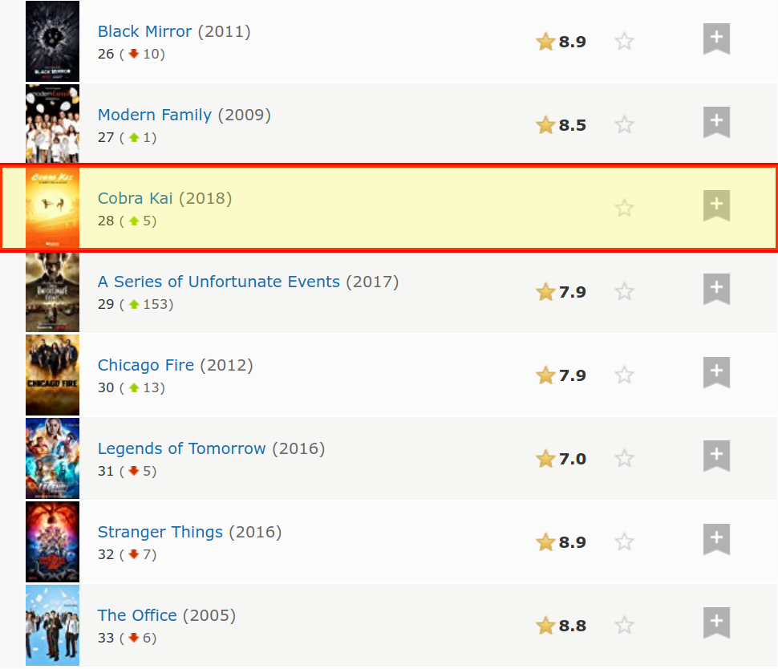

class: center, middle, title-slide

.upper-right[
```{r logo, echo = FALSE, out.width = "605px"}
knitr::include_graphics("../img/cds-101-a01-logo.png")
```
]

.lower-right[
```{r cc-by-sa, echo = FALSE, out.width = "88px"}
knitr::include_graphics("../img/cc-by-sa.png")
```

These slides are licensed under a [Creative Commons Attribution-ShareAlike 4.0 International License](http://creativecommons.org/licenses/by-sa/4.0/).
]

# Class 13: Introduction to Web Scraping II
.title-hline[
## June 7, 2018
]

---

class: middle, center, inverse

# General

```{r setup, include = FALSE}
# DO NOT ALTER THIS CHUNK
source("../src/xaringan_setup.R")
# Load required packages
suppressPackageStartupMessages(library(tidyverse))
suppressPackageStartupMessages(library(rvest))
# Datafile
tv_rds_20180607 <- read_rds("../data/2018-06-07T1025EDT_imdb_tv.rds")
```

---

# Annoucements

.valign-slide[
* Reading 10 on web scraping posted, submit questions by 9:00am on Friday, June 8th

* Homework 3 on web scraping posted, due by 11:59pm on Tuesday, June 12th

* Be prepared to share and discuss your proposed questions for the Midterm Project on Friday, June 8th
]

---

class: middle, center, inverse

# Web Scraping Activity

---

# Web scraping activity

.qa[
Navigate to <http://www.imdb.com/chart/tvmeter> and scrape the list of the most popular TV shows.
The result should be a tibble with 100 rows and 4 columns: rank, tv show name, year, and rating.
The variables should be in this order.
]

--

* The code blocks from the Top 250 Movies example will work for some, but not all of this exercise.

--

* Primary objective is to use the SelectorGadget tool to modify the HTML nodes you need to grab

--

* How do you take the example code and modify it to work for this activity?

---

layout: true

# Scraping code: IMDB Top 250 Movies

---

.code80[
```r
page <- read_html("http://www.imdb.com/chart/top")

titles <- page %>%
  html_nodes(".titleColumn a") %>%
  html_text()

years <- page %>%
  html_nodes(".secondaryInfo") %>%
  html_text() %>%
  str_remove("\\(") %>% # remove (
  str_remove("\\)") %>% # remove )
  as.numeric()

scores <- page %>%
  html_nodes("#main strong") %>%
  html_text() %>%
  as.numeric()
  
imdb_top_250 <- data_frame(
  title = titles,
  year = years,
  score = scores
)
```
]

---

count: false

.code80[
```r
*page <- read_html("http://www.imdb.com/chart/top")

titles <- page %>%
  html_nodes(".titleColumn a") %>%
  html_text()

years <- page %>%
  html_nodes(".secondaryInfo") %>%
  html_text() %>%
  str_remove("\\(") %>% # remove (
  str_remove("\\)") %>% # remove )
  as.numeric()

scores <- page %>%
  html_nodes("#main strong") %>%
  html_text() %>%
  as.numeric()
  
imdb_top_250 <- data_frame(
  title = titles,
  year = years,
  score = scores
)
```
]

---

count: false

.code80[
```r
*page <- read_html("http://www.imdb.com/chart/tvmeter")

titles <- page %>%
  html_nodes(".titleColumn a") %>%
  html_text()

years <- page %>%
  html_nodes(".secondaryInfo") %>%
  html_text() %>%
  str_remove("\\(") %>% # remove (
  str_remove("\\)") %>% # remove )
  as.numeric()

scores <- page %>%
  html_nodes("#main strong") %>%
  html_text() %>%
  as.numeric()
  
imdb_top_250 <- data_frame(
  title = titles,
  year = years,
  score = scores
)
```
]

---

count: false

.code80[
```r
page <- read_html("http://www.imdb.com/chart/tvmeter")

*titles <- page %>%
* html_nodes(".titleColumn a") %>%
* html_text()

years <- page %>%
  html_nodes(".secondaryInfo") %>%
  html_text() %>%
  str_remove("\\(") %>% # remove (
  str_remove("\\)") %>% # remove )
  as.numeric()

scores <- page %>%
  html_nodes("#main strong") %>%
  html_text() %>%
  as.numeric()
  
imdb_top_250 <- data_frame(
  title = titles,
  year = years,
  score = scores
)
```
]

---

layout: false

# TV show titles

```{r imdb-top-tv-download-html, include = FALSE, eval = FALSE, echo = FALSE}
# Downloads local copy of IMDB TV meter page HTML and time stamps the filename
xml2::download_html(
  url = "http://www.imdb.com/chart/tvmeter",
  file = glue::glue("../data/{format(Sys.time(), '%FT%H%M%Z')}_imdb_tv.html"),
  mode = "w"
)
```

```{r imdb-top-tv-page, eval = TRUE, echo = FALSE}
page <- read_html("../data/2018-06-08T2035EDT_imdb_tv.html")
```

Let's check to see if it's actually necessary to change the `titles` code:

```{r imdb-top-tv-titles, eval = TRUE}
titles <- page %>%
  html_nodes(".titleColumn a") %>%
  html_text()
```

--

The length of the `titles` vector is:

```{r imdb-top-tv-titles-length, eval = TRUE}
length(titles)
```

--

And the first 10 elements in `titles` are:

```{r imdb-top-tv-titles-output, eval = TRUE, echo = FALSE}
head(titles, n = 10)
```

--

So far, so good!

---

# TV show years

.code80[
```r
page <- read_html("http://www.imdb.com/chart/tvmeter")

titles <- page %>%
  html_nodes(".titleColumn a") %>%
  html_text()

*years <- page %>%
* html_nodes(".secondaryInfo") %>%
* html_text() %>%
* str_remove("\\(") %>% # remove (
* str_remove("\\)") %>% # remove )
* as.numeric()

scores <- page %>%
  html_nodes("#main strong") %>%
  html_text() %>%
  as.numeric()
  
imdb_top_250 <- data_frame(
  title = titles,
  year = years,
  score = scores
)
```
]

---

# TV show years

Next, let's check if the `years` code works for us:

```{r imdb-top-tv-years, eval = TRUE}
years <- page %>%
  html_nodes(".secondaryInfo") %>%
  html_text() %>%
  str_remove("\\(") %>% # remove (
  str_remove("\\)")     # remove )
```

--

And the first few elements in `years` are:

```{r imdb-top-tv-years-output, eval = TRUE, echo = FALSE}
head(years, n = 8)
```

--

Not so lucky this time.
--

Let's see how we can fix this.

---

# SelectorGadget `years` demo

.vhalign-slide[
Follow along in Google Chrome
]

---

# TV show years (revised)

Here's our revised `years` code based on our SelectorGadget work:

```{r imdb-top-tv-years-revised, eval = TRUE}
years <- page %>%
  html_nodes("a + .secondaryInfo") %>%
  html_text() %>%
  str_remove("\\(") %>% # remove (
  str_remove("\\)")     # remove )
```

--

The first 10 elements in our revised `years` are:

```{r imdb-top-tv-years-revised-output, eval = TRUE, echo = FALSE}
head(years, n = 10)
```

--

Much better!

.footnote[
**Note:** We should append `%>% as.numeric()` to our `years` definition so that
the years are interpreted by R as integers, not text.
]

---

# TV show user scores

.code80[
```r
page <- read_html("http://www.imdb.com/chart/tvmeter")

titles <- page %>%
  html_nodes(".titleColumn a") %>%
  html_text()

years <- page %>%
  html_nodes("a + .secondaryInfo") %>%
  html_text() %>%
  str_remove("\\(") %>% # remove (
  str_remove("\\)") %>% # remove )
  as.numeric()

*scores <- page %>%
* html_nodes("#main strong") %>%
* html_text() %>%
* as.numeric()
  
imdb_top_250 <- data_frame(
  title = titles,
  year = years,
  score = scores
)
```
]

---

# TV show user scores

Will the `scores` code work?

```{r imdb-top-tv-scores, eval = TRUE}
scores <- page %>%
  html_nodes("#main strong") %>%
  html_text() %>%
  as.numeric()
```

--

The first 10 elements in `scores` are:

```{r imdb-top-tv-scores-output, eval = TRUE, echo = FALSE}
head(scores, n = 10)
```

--

As of right now, this is working as expected if we check the number of elements in `scores`:

```{r imdb-top-tv-scores-length, eval = TRUE}
length(scores)
```

--

However...
--
 just a couple of months ago, I got `99` instead of `100` when running this code.
--

Why would that happen?

---

# Blank TV show scores

```{r imdb-top-tv-scores-blank, echo = FALSE, out.width = "80%"}

```

---

# SelectorGadget `scores` demo

.vhalign-slide[
Follow along in Google Chrome
]

---

# TV show user scores (revised)

Here's our revised `scores` code based on our SelectorGadget work that will take into account shows that may have a missing score:

```{r imdb-top-tv-scores-revised, eval = TRUE}
scores <- page %>%
  html_nodes(".imdbRating") %>%
  html_text() %>%
  as.numeric()
```

--

The first 10 elements in our revised `scores` are:

```{r imdb-top-tv-scores-revised-output, eval = TRUE, echo = FALSE}
head(scores, n = 10)
```

--

That hasn't changed, and the number of elements in `scores` is:

```{r imdb-top-tv-scores-revised-length, eval = TRUE}
length(scores)
```

---

# Creating the data tibble

.code80[
```r
page <- read_html("http://www.imdb.com/chart/tvmeter")

titles <- page %>%
  html_nodes(".titleColumn a") %>%
  html_text()

years <- page %>%
  html_nodes("a + .secondaryInfo") %>%
  html_text() %>%
  str_remove("\\(") %>% # remove (
  str_remove("\\)") %>% # remove )
  as.numeric()

scores <- page %>%
  html_nodes(".imdbRating") %>%
  html_text() %>%
  as.numeric()
  
*imdb_top_250 <- data_frame(
* title = titles,
* year = years,
* score = scores
*)
```
]

---

# TV show rank

The shows on the page are already sorted by rank.

--

So we can just use the row numbers to create the rank column:

```r
imdb_top_tv <- data_frame(
  title = titles,
  year = years,
  score = scores
) %>%
  mutate(rank = row_number())
```

---

# TV show tibble

We have everything we need, so let's take the original code for making the tibble:

--

```r
imdb_top_tv <- data_frame(
  title = titles,
  year = years,
  score = scores
)
```

--

and change the variable name to `imdb_top_tv`, put the columns in the correct order, and add in the ranks column:

--

```{r imdb-top-tv-tibble, eval = TRUE}
imdb_top_tv <- data_frame(
  title = titles, year = years, score = scores) %>%
  mutate(rank = row_number()) %>%
  select(rank, title, year, score)
```

---

# Create a RDS file

Finally, let's save our work so that we don't need to always reconnect to the website:

--

```{r imdb-top-tv-write-rds, eval = FALSE}
imdb_top_tv %>%
  write_rds("2018-06-08T2035EDT_imdb_tv.rds", compress = "gz")
```

--

Notice that the date and time that the data was scraped is part of the filename.

--

The list on this webpage changes frequently, so this documents when the scraping occured!

---

# Complete scraping code

.code80[
```r
page <- read_html("http://www.imdb.com/chart/tvmeter")

titles <- page %>%
  html_nodes(".titleColumn a") %>%
  html_text()

years <- page %>%
  html_nodes("a + .secondaryInfo") %>%
  html_text() %>%
  str_remove("\\(") %>% # remove (
  str_remove("\\)") %>% # remove )
  as.numeric()

scores <- page %>%
  html_nodes(".imdbRating") %>%
  html_text() %>%
  as.numeric()
  
imdb_top_tv <- data_frame(
  title = titles, year = years, score = scores) %>%
  mutate(rank = row_number()) %>%
  select(rank, title, year, score)
```
]

---

# IMDB TV Table

```{r imdb-scraped-tv-table, echo=FALSE, eval = TRUE, results='asis'}
tv_rds_20180607 %>% head(10) %>%
  rbind(rep("...", 3)) %>%
  knitr::kable(format = "html")
```

---

# Credits

.valign-slide[
These slides were adapted from the following sources:

* The [Web Scraping slides][sta112-fa17-nov16-slides] and [Mini HW 12 - Web Scraping assignment][sta112-fa17-mini-hw-12] developed by Mine Çetinkaya-Rundel and made available under the [CC BY 4.0 license](http://creativecommons.org/licenses/by-sa/4.0/us/).
]

[sta112-fa17-mini-hw-12]:   http://www2.stat.duke.edu/courses/Fall17/sta112.01/assignment/12-mini-hw.html
[sta112-fa17-nov16-slides]: http://www2.stat.duke.edu/courses/Fall17/sta112.01/slides/21-deck.html
