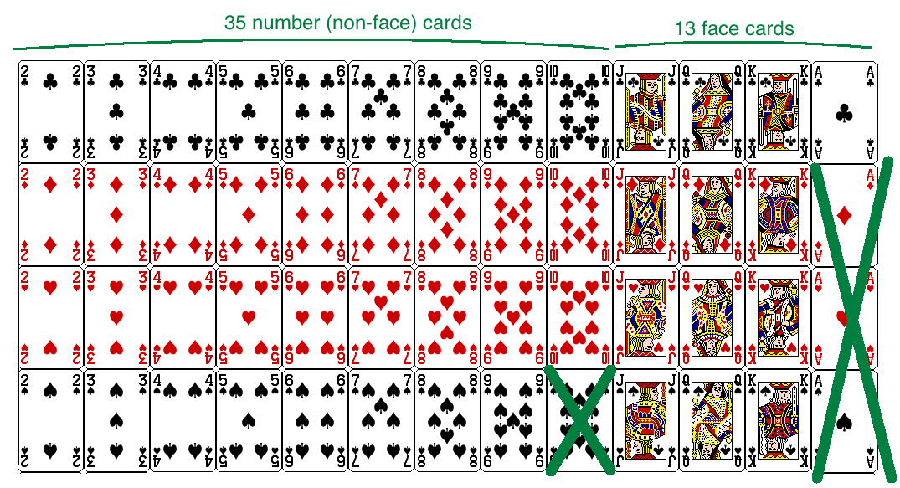

class: center, middle, title-slide

.upper-right[
```{r logo, echo = FALSE, out.width = "605px"}
knitr::include_graphics("../img/cds-101-a01-logo.png")
```
]

.lower-right[
```{r cc-by-sa, echo = FALSE, out.width = "88px"}
knitr::include_graphics("../img/cc-by-sa.png")
```

These slides are licensed under a [Creative Commons Attribution-ShareAlike 4.0 International License](http://creativecommons.org/licenses/by-sa/4.0/).
]

# Class 15: Inference and simulation I
.title-hline[
## June 11, 2018
]

---

class: middle, center, inverse

# General

```{r setup, include = FALSE}
# DO NOT ALTER THIS CHUNK
source("../src/xaringan_setup.R")
# Load required packages
suppressPackageStartupMessages(library(tidyverse))
suppressPackageStartupMessages(library(infer))
```

---

# Annoucements

.valign-slide[
* Questions for Reading 13 due on **June 13** by 9:00am: [Introductory Statistics with Randomization and Simulation](http://summer18.cds101.com/doc/Diez_Barr_%C3%87etinkaya-Rundel_IntroductoryStatisticsWithRandomizationAndSimulation.pdf)

  * From chapter 2: section 2.4 through to the end of section 2.5

  * From chapter 4: section 4.5 (skip 4.5.3)

* Homework 3 due date pushed back to **11:59pm on Wednesday, June 13th**

* Midterm reports and presentation slides due at the start of class on Thursday, June 14th
]

---

# Midterm project: rough drafts

.valign-slide[
* Whatever you have, push it to Github.

* If the questions are spread out in the various group member branches, let me know by posting this in your Slack channels for your midterm group

* I will be ending class early so that I can go and review these immediately after class, I will leave feedback in a *Pull Request* and post in your group's Slack channel when I am done
]

---


class: middle, center, inverse

# Data and drawing conclusions: limits set by experimental sampling

---

# Populations and samples

**Research question**: Can people become better, more efficient runners on their own, merely by running?

```{r running-figure, out.width = "45%", fig.align = "center", echo = FALSE}

```

<span style="font-size: 0.7em;">Source: <http://well.blogs.nytimes.com/2012/08/29/finding-your-ideal-running-form></span>

---

count: false

# Populations and samples

```{r running-figure2, out.width = "40%", fig.align = "center", echo = FALSE}

```

**Research question**: Can people become better, more efficient runners on their own, merely by running?
--

.qa[Question: What is the population of interest?]
--

.answer[Answer: All people]

--

**Study Sample**: Group of adult women who recently joined a running group
--

.qa[Question: Population to which results can be generalized?]
--

.answer[Answer: Adult women, if the data are randomly sampled]

---

# Anecdotal evidence and early smoking research

*   Anti-smoking research started in the 1930s and 1940s when cigarette smoking became increasingly popular. While some smokers seemed to be sensitive to cigarette smoke, others were completely unaffected.

.footnote[Source: Brandt, *The Cigarette Century* (2009), Basic Books.]

--

*   Anti-smoking research was faced with resistance based on **anecdotal evidence** such as "My uncle smokes three packs a day and he's in perfectly good health", evidence based on a limited sample size that might not be representative of the population.

--

*   It was concluded that "smoking is a complex human behavior, by its nature difficult to study, confounded by human variability."

--

*   In time researchers were able to examine larger samples of cases (smokers), and trends showing that smoking has negative health impacts became much clearer.

---

# Sampling from a population: Census

.footnote[Source: http://www.npr.org/templates/story/story.php?storyId=125380052]

*   Wouldn't it be better to just include everyone and "sample" the entire population? 
--

*   This is called a **census**.
--

*   There are problems with taking a census:
--

*   *It can be difficult to complete a census:* there always seem to be some individuals who are hard to locate or hard to measure. **And these difficult-to-find people may have certain characteristics that distinguish them from the rest of the population.**
--

*   Populations rarely stand still. Even if you could take a census, the population changes constantly, so it's never possible to get a perfect measure.
--

*   Taking a census may be more complex than sampling.

---

# Exploratory analysis to inference

*   Sampling is natural

--

*   Think about sampling something you are cooking - you taste (examine) a small part of what you're cooking to get an idea about the dish as a whole.

--

*   When you taste a spoonful of soup and decide the spoonful you tasted isn't salty enough, that's **exploratory analysis**.

--

*   If you generalize and conclude that your entire soup needs salt, that's an **inference**.

--

*   For your inference to be valid, the spoonful you tasted (the sample) needs to be **representative** of the entire pot (the population).

--

*   If your spoonful comes only from the surface and the salt is collected at the bottom of the pot, what you tasted is probably not representative of the whole pot.

--

*   If you first stir the soup thoroughly before you taste, your spoonful will more likely be representative of the whole pot.

---

# Sampling bias

*   **Non-response**: If only a small fraction of the randomly sampled people choose to respond to a survey, the sample may no longer be representative of the population.

*   **Voluntary response**: Occurs when the sample consists of people who volunteer to respond because they have strong opinions on the issue. Such a sample will also not be representative of the population.

--

.pull-left[
```{r responses-figures-1, out.width = "50%", echo = FALSE}
knitr::include_graphics("../img/vol_resp_bias_q.png")
```
]

.pull-right[
```{r responses-figures-2, out.width = "50%", echo = FALSE}
knitr::include_graphics("../img/vol_resp_bias_res.png")
```
]

.footnote[
Source: cnn.com, Jan 14, 2012
]

--

*   **Convenience sample**: Individuals who are easily accessible are more likely to be included in the sample.

---

# Sampling bias example: Landon vs. FDR

A historical example of a biased sample yielding misleading results:

--

.pull-left[
```{r landon-figure-1, out.width = "50%", echo = FALSE}
knitr::include_graphics("../img/landon.png")
```
]

.pull-right[
```{r landon-figure-2, out.width = "50%", echo = FALSE}
knitr::include_graphics("../img/fdr.png")
```
]

In 1936, Landon sought the Republican presidential nomination opposing the re-election of FDR.

---

# The Literary Digest Poll

*   The Literary Digest polled about 10 million Americans, and got responses from about 2.4 million.

--

*   The poll showed that Landon would likely be the overwhelming winner and FDR would get only 43% of the votes.

--

*   Election result:  FDR won, with 62% of the votes.

--

```{r literary-digest-figure, out.width = "20%", echo = FALSE}
knitr::include_graphics("../img/literaryDigest.png")
```

*   The magazine was completely discredited because of the poll, and was soon discontinued.

---

# .font90[The Literary Digest Poll - what went wrong?]

The magazine had surveyed:

--

* Its own readers

--

* Registered automobile owners

--

* Registered telephone users

--

These groups had incomes well above the national average of the day (remember, this is Great Depression era) which resulted in lists of voters far more likely to support Republicans than a truly **typical** voter of the time, i.e. the sample was not representative of the American population at the time.

---

# Large samples are preferable, but...

*   The Literary Digest election poll was based on a sample size of 2.4 million, which is huge, but since the sample was **biased**, the sample did not yield an accurate prediction.

--

*   Back to the soup analogy: If the soup is not well stirred, it doesn't matter how large a spoon you have, it will still not taste right. If the soup is well stirred, a small spoon will suffice to test the soup.

---

class: middle, center, inverse

# "Correlation does not imply causation"

---

# Explanatory and response variables

* To identify the explanatory variable in a pair of variables, identify which of the two is suspected of affecting the other:

--

* explanatory variable $\xrightarrow{might~affect}$response variable

--

* Labeling variables as explanatory and response does not guarantee the relationship between the two is actually causal, even if there is an association identified between the two variables. We use these labels only to keep track of which variable we suspect affects the other.

---

# Observational studies and experiments

*   **Observational study**: Researchers collect data in a way that does not directly interfere with how the data arise, i.e. they merely "observe", and can only establish an association between the explanatory and response variables.

--

*   **Experiment**: Researchers randomly assign subjects to various treatments in order to establish causal connections between the explanatory and response variables.

--

*   If you're going to walk away with one thing from the last few weeks of this class, let it be "correlation does not imply causation".

```{r xkcd-figure, out.width = "55%", echo = FALSE}
knitr::include_graphics("../img/xkcd_correlation.png")
```

.footnote[
Source: http://xkcd.com/552/
]

---

class: middle, center, inverse

# Case study: Gender discrimination

---

# Study description and data

.footnote[B.Rosen and T. Jerdee (1974), "Influence of sex role stereotypes on personnel decisions", J.Applied Psychology, 59:9-14.]

*   In 1972, as a part of a study on gender discrimination, 48 male bank supervisors were each given the same personnel file and asked to judge whether the person should be promoted to a branch manager job that was described as "routine". 

--

*   The files were identical except that half of the supervisors had files showing the person was male while the other half had files showing the person was female.

--

*   It was randomly determined which supervisors got "male" applications and which got "female" applications.  

--

*   Of the 48 files reviewed, 35 were promoted. 

--

*   The study is testing whether females are unfairly discriminated against.  

--

.answer[
This is an example of an *experiment*
]

---

# Data

.qa[At a first glance, does there appear to be a relatonship between promotion and gender?]

|   | Promoted | Not Promoted | Total |
| --- | --- | --- | --- |
| Male | 21 | 3 | 24 |
| Female | 14 | 10 | 24 |
| Total | 35 | 13 | 48 |

--

**% of males promoted:** 21 / 24 = 0.875

--

**% of females promoted:** 14 / 24 = 0.583
  
---

# Practice

.qa[
We saw a difference of almost 30% (29.2% to be exact) between the proportion of male and female files that are promoted.
Based on this information, which of the below is true?
]

1.  If we were to repeat the experiment we will definitely see that more female files get promoted. This was a fluke.

2.  Promotion is dependent on gender, males are more likely to be promoted, and hence there is gender discrimination against women in promotion decisions.

3.  The difference in the proportions of promoted male and female files is due to chance, this is not evidence of gender discrimination against women in promotion decisions.

4.  Women are less qualified than men, and this is why fewer females get promoted.

---

count: false

# Practice

.qa[
We saw a difference of almost 30% (29.2% to be exact) between the proportion of male and female files that are promoted.
Based on this information, which of the below is true?
]

1.  If we were to repeat the experiment we will definitely see that more female files get promoted. This was a fluke.

2.  Promotion is dependent on gender, males are more likely to be promoted, and hence there is gender discrimination against women in promotion decisions. .red[Maybe]

3.  The difference in the proportions of promoted male and female files is due to chance, this is not evidence of gender discrimination against women in promotion decisions. .red[Maybe]

4.  Women are less qualified than men, and this is why fewer females get promoted.

---

# Two competing claims

1.  "There is nothing going on."

--

    Promotion and gender are **independent**, no gender discrimination, observed difference in proportions is simply due to chance. → **Null hypothesis**
    
--
    
2.  "There is something going on."

--

    Promotion and gender are **dependent**, there is gender discrimination, observed difference in proportions is not due to chance. → **Alternative hypothesis**

---

# A trial as a hypothesis test

.footnote[
Image from http://www.nwherald.com/_internal/cimg!0/oo1il4sf8zzaqbboq25oevvbg99wpot
]

.pull-left[
* As a process, hypothesis testing is analogous to a court trial

* *H<sub>0</sub>*: Defendant is innocent

  *H<sub>A</sub>*: Defendant is guilty

* We then present the evidence – collect data.
]

.pull-right[
```{r trial-image, echo = FALSE, out.width = "80%"}
knitr::include_graphics("../img/trial.png")
```
]

--

* Then we judge the evidence – "Could these data plausibly have happened by chance if the null hypothesis were true?"

--

* If they were very unlikely to have occurred, then the evidence raises more than a reasonable doubt in our minds about the null hypothesis

--

* Ultimately we must make a decision. How unlikely is unlikely?

---

# A trial as a hypothesis test

* If the evidence is not strong enough to reject the assumption of innocence, the jury returns with a verdict of "not guilty"

--

* The jury does not say that the defendant is innocent, just that there is not enough evidence to convict

--

* The defendant may, in fact, be innocent, but the jury has no way of being sure

--

* Said statistically, we fail to reject the null hypothesis

--

* We never declare the null hypothesis to be true, because we simply do not know whether it's true or not

--

* Therefore we never "accept the null hypothesis"

--

* In a trial, the burden of proof is on the prosecution.

--

* In a hypothesis test, the burden of proof is on the unusual claim.

--

* The null hypothesis is the ordinary state of affairs, so it's the alternative hypothesis that we consider unusual and for which we must gather evidence.

---

# Recap: hypothesis testing framework

.valign-slide[
* We start with a null hypothesis (*H<sub>0</sub>*) that represents the status quo

* We also have an alternative hypothesis (*H<sub>A</sub>*) that represents our research question, i.e. what we're testing for

* We conduct a hypothesis test under the assumption that the null hypothesis is true, either via simulation or theoretical methods

  * If the test results suggest that the data do not provide convincing evidence for the alternative hypothesis, we stick with the null hypothesis
  
  * If they do, then we reject the null hypothesis in favor of the alternative
]

---

# Simulating the experiment

Let's simulate the scenario from the case study under the assumption of independence, i.e. leave things up to chance.

--

* If results from the simulations based on the **chance model** look like the data, then we can determine that the difference between the proportions of promoted files between males and females was simply **due to chance** (promotion and gender are independent).

--

* If the results from the simulations based on the chance model do not look like the data, then we can determine that the difference between the proportions of promoted files between males and females was not due to chance, but **due to an actual effect of gender** (promotion and gender are dependent).

---

# .font80[Simulating the experiment with a deck of cards]

.font90[
Pretend for a moment that we didn't have a computer available, how could we simulate this experiment using playing cards?
]

---

count: false

# .font80[Simulating the experiment with a deck of cards]

.font90[
Pretend for a moment that we didn't have a computer available, how could we simulate this experiment using playing cards?

1. Let a face card represent *not promoted* and a non-face card represent *promoted*

  * Consider aces as face cards
  
  * Set aside the jokers
  
  * Take out 3 aces → there are exactly 13 face cards left in the deck (face cards: A, K, Q, J)
  
  * Take out a number card → there are exactly 35 number (non-face) cards left in the deck (number cards: 2-10)
]

---

count: false

# .font80[Simulating the experiment with a deck of cards]

.font90[
Pretend for a moment that we didn't have a computer available, how could we simulate this experiment using playing cards?

1. Let a face card represent *not promoted* and a non-face card represent *promoted*

  * Consider aces as face cards
  
  * Set aside the jokers
  
  * Take out 3 aces → there are exactly 13 face cards left in the deck (face cards: A, K, Q, J)
  
  * Take out a number card → there are exactly 35 number (non-face) cards left in the deck (number cards: 2-10)

2. Shuffle the cards and deal them intro two groups of size 24, representing males and females
]

---

count: false

# .font80[Simulating the experiment with a deck of cards]

.font90[
Pretend for a moment that we didn't have a computer available, how could we simulate this experiment using playing cards?

1. Let a face card represent *not promoted* and a non-face card represent *promoted*

  * Consider aces as face cards
  
  * Set aside the jokers
  
  * Take out 3 aces → there are exactly 13 face cards left in the deck (face cards: A, K, Q, J)
  
  * Take out a number card → there are exactly 35 number (non-face) cards left in the deck (number cards: 2-10)

2. Shuffle the cards and deal them intro two groups of size 24, representing males and females

3. Count and record how many files in each group are promoted (number cards)
]

---

count: false

# .font80[Simulating the experiment with a deck of cards]

.font90[
Pretend for a moment that we didn't have a computer available, how could we simulate this experiment using playing cards?

1. Let a face card represent *not promoted* and a non-face card represent *promoted*

  * Consider aces as face cards
  
  * Set aside the jokers
  
  * Take out 3 aces → there are exactly 13 face cards left in the deck (face cards: A, K, Q, J)
  
  * Take out a number card → there are exactly 35 number (non-face) cards left in the deck (number cards: 2-10)

2. Shuffle the cards and deal them intro two groups of size 24, representing males and females

3. Count and record how many files in each group are promoted (number cards)

4. Calculate the proportion of promoted files in each group and take the difference (male - female), and record this value
]

---

count: false

# .font80[Simulating the experiment with a deck of cards]

.font90[
Pretend for a moment that we didn't have a computer available, how could we simulate this experiment using playing cards?

1. Let a face card represent *not promoted* and a non-face card represent *promoted*

  * Consider aces as face cards
  
  * Set aside the jokers
  
  * Take out 3 aces → there are exactly 13 face cards left in the deck (face cards: A, K, Q, J)
  
  * Take out a number card → there are exactly 35 number (non-face) cards left in the deck (number cards: 2-10)

2. Shuffle the cards and deal them intro two groups of size 24, representing males and females

3. Count and record how many files in each group are promoted (number cards)

4. Calculate the proportion of promoted files in each group and take the difference (male - female), and record this value

5. Repeat steps 2 – 4 many times
]

---

# Step 1

```{r playing-card-sim-1, echo = FALSE, out.width = "100%"}

```

---

# Step 2

```{r playing-card-sim-2, echo = FALSE, out.width = "100%"}
knitr::include_graphics("../img/simulation_step2.png")
```

---

# Credits

.valign-slide[
These slides were adapted from the chapter 1 and chapter 3 [OpenIntro Statistics slides](https://github.com/OpenIntroOrg/openintro-statistics-slides) developed by Mine Çetinkaya-Rundel and made available under the [CC BY-SA 3.0 license](http://creativecommons.org/licenses/by-sa/3.0/us/).
]
