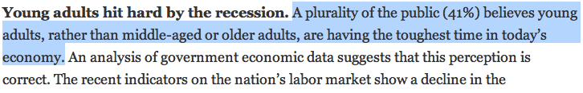

class: center, middle, title-slide

.upper-right[
```{r logo, echo = FALSE, out.width = "605px"}
knitr::include_graphics("../img/cds-101-a01-logo.png")
```
]

.lower-right[
```{r cc-by-sa, echo = FALSE, out.width = "88px"}
knitr::include_graphics("../img/cc-by-sa.png")
```

These slides are licensed under a [Creative Commons Attribution-ShareAlike 4.0 International License](http://creativecommons.org/licenses/by-sa/4.0/).
]

# Class 17: Inference and simulation III
.title-hline[
## June 13, 2018
]

---

class: middle, center, inverse

# General

```{r setup, include = FALSE}
# DO NOT ALTER THIS CHUNK
source("../src/xaringan_setup.R")
# Load required packages
suppressPackageStartupMessages(library(tidyverse))
suppressPackageStartupMessages(library(infer))
# Set seed
set.seed(732083)
# yawn dataset
yawn <- read_csv("../data/yawn.csv")
experiment_result <- 0.2941 - 0.2500
# county dataset
county <- read_rds("../data/county_complete.rds")
```

---

# Annoucements

.font90[
* Midterm reports and presentation slides due by the start of class on Thursday, June 14th

  * Each group's presentation must be given tomorrow and it cannot be made up, being absent results in an automatic zero for the presentation part of your project grade

* Written responses (not questions) to Reading 14 (to be posted) due on **June 15** by 9:00am

  * Last reading that requires you to post on Slack after completing it

* Homework 3 due by **11:59pm on Friday, June 13th**

* Homework 4 to be posted soon, will be due by **11:59pm on Wednesday, June 20th**

* Homework 5 will also be posted soon and will be an **optional extra credit assignment** also due by **11:59pm on Wednesday, June 20th**

  * Homework 4 must be submitted before you can turn in Homework 5

* Details for Final will be discussed tomorrow after the Midterm Project presentations
]

---

# On the midterm project presentations

.valign-slide[
* Presentation order

  * I flipped a coin, Team 1 goes first, then Team 2

* Equipment

  * Students usually like to use one of their own laptops for the presentation
  
  * Make sure you bring any video adaptors you might need for HDMI or VGA outputs
  
  * My laptop is available: Powerpoint slides will be uploaded and presented using Powerpoint Online
]

---

count: false

# On the midterm project presentations

* Reminder of expectations

  * Review the midterm project instructions for details such as presentation length and what to discuss
  
  * Each group member is expected to speak an approximately equal amount of time
  
  * **The slides must look uniform and all content from every group member must be in a single Powerpoint/Google Slides file**
  
  * Figures from `ggplot2` should be saved as PNG files using `ggsave()` and then imported into the slideshow
  
  * Tables should be in the presentation software's native format

* You will fill out a brief form I give to you to evaluate the other team's presentation

* Class will continue after the presentations, which should not take up more than the first half hour of the class

---

class: middle, center, inverse

# Variability of estimates

---

# Pew Research Survey

```{r pew-page-one, echo = FALSE, out.width = "90%"}
knitr::include_graphics("../img/pew1.png")

knitr::include_graphics("../img/pew3.png")
```

.footnote[
http://pewresearch.org/pubs/2191/young-adults-workers-labor-market-pay-careers-advancement-recession
]

---


# Margin of error

```{r pew4, echo = FALSE, out.width = "90%"}
knitr::include_graphics("../img/pew4.png")
```

*   41% ± 2.9%: We are 95% confident that 38.1% to 43.9% of the public believe young adults, rather than middle-aged or older adults, are having the toughest time in today's economy.

*   49% ± 4.4%: We are 95% confident that 44.6% to 53.4% of 18–34 years olds have taken a job they didn't want just to pay the bills.

---

# Parameter estimation

*   We are often interested in **population parameters**.

--

*   Since complete populations are difficult (or impossible) to collect data on, we use **sample statistics** as **point estimates** for the unknown population parameters of interest.

--

*   Sample statistics vary from sample to sample.

--

*   Quantifying how sample statistics vary provides a way to estimate the **margin of error** associated with our point estimate.

--

*   But before we get to quantifying the variability among samples, let's try to understand how and why point estimates vary from sample to sample.

--

.qa[
Suppose we randomly sample 1,000 adults from each state in the US.
Would you expect the sample means of their heights to be the same, somewhat different, or very different?
]

--

.answer[Not the same, but only somewhat different.]

---

class: middle, center, inverse

# Confidence intervals

---

# Why do we report confidence intervals?

.footnote[
Photos by Mark Fischer (http://www.flickr.com/photos/fischerfotos/7439791462) and Chris Penny (http://www.flickr.com/photos/clearlydived/7029109617) on Flickr.
<!-- spear fig: http://www.flickr.com/photos/clearlydived/7029109617/sizes/q/ -->
<!-- net fig: http://www.flickr.com/photos/fischerfotos/7439791462/sizes/q/ -->
]

.font90[
* A plausible range of values for the population parameter is called a **confidence interval**.
]

--

.font90[
* Using only a sample statistic to estimate a parameter is like fishing in a murky lake with a spear, and using a confidence interval is like fishing with a net.
]

--

.pull-left[
```{r spear-fishing-figure, echo = FALSE, out.width = "40%"}
knitr::include_graphics("../img/spear.jpg")
```

.font80[
We can throw a spear where we saw a fish but we will probably miss.
]
]

--

.pull-right[
```{r net-fishing-figure, echo = FALSE, out.width = "40%"}

```

.font80[
If we toss a net in that area, we have a good chance of catching the fish.
]
]

--

.font90[
* By analogy, if we report a point estimate (such as the mean or median), we probably won't hit the exact population parameter.
]

--

.font90[
* If we report a range of plausible values we have a good shot at capturing the parameter. 
]

---

# .font90[Example: Constructing a confidence interval]

.qa[
What is the 95% confidence interval for the *Mythbusters* yawning experiment?
]

--

* We can use the bootstrap simulation from `infer`:

---

# What is a bootstrap simulation?

.vhalign-slide[
[Bootstrap on *Seeing Theory*](http://students.brown.edu/seeing-theory/frequentist-inference/index.html#section3)
]

---

# .font90[Example: Constructing a confidence interval]

.qa[
What is the 95% confidence interval for the *Mythbusters* yawning experiment?
]

.font80[
* We can use the bootstrap simulation from `infer`:
]

--

.code80[
```{r yawn-bootstrap, echo = TRUE, eval = TRUE}
yawn_bootstrap <- yawn %>%
  specify(yawn ~ group, success = "yes") %>%
  generate(reps = 1000, type = "bootstrap") %>%
  calculate(stat = "diff in props", order = combine("Treatment", "Control"))
```
]

--

.pull-left[
.code70[
```{r yawn-ci-bounds, eval = TRUE, echo = TRUE}
yawn_ci_bounds <- yawn_bootstrap %>%
  mutate(rank = min_rank(stat)) %>%  
  filter(
    between(rank, n() * 0.025, n() * 0.975)
  ) %>%
  summarize(
    lower = min(stat),
    upper = max(stat)
  )
```
]

.font80[
```{r yawn-ci-bounds-table, eval = TRUE, echo = FALSE}
yawn_ci_bounds %>%
  knitr::kable(format = "html")
```
]
]

.pull-right.font90.code80[
* `min_rank(stat)` is the stat column's sorting order from smallest to largest
* `0.025 * n()` is the `rank` that defines the threshold for the 2.5th percentile
* `0.975 * n()` is the `rank` that defines the threshold for the 97.5th percentile
* `min(stat)` and `max(stat)` gives thresholds for the 2.5th and 97.5th percentiles 
]

---

count: no

# .font90[Example: Constructing a confidence interval]

.qa[
What is the 95% confidence interval for the *Mythbusters* yawning experiment?
]

```{r yawn-ci-plot, eval = TRUE, echo = FALSE, out.width = "80%"}
yawn_bootstrap %>%
  ggplot() +
  geom_histogram(mapping = aes(x = stat), binwidth = 0.05, center = 0) +
  annotate(
    "rect", xmin = pull(yawn_ci_bounds, lower),
    xmax = pull(yawn_ci_bounds, upper), ymin = -Inf,
    ymax = Inf, fill = "indianred2", alpha = .3) +
  geom_vline(xintercept = pull(yawn_ci_bounds, lower),
             color = "indianred3", size = 1) +
  geom_vline(xintercept = pull(yawn_ci_bounds, upper),
             color = "indianred3", size = 1) +
  geom_vline(xintercept = experiment_result, color = "black",
             linetype = "dashed", size = 1) +
  scale_x_continuous(breaks = scales::pretty_breaks(n = 11)) +
  labs(
    x = "difference in yawn fractions", y = "frequency",
    title = "Bootstrap distribution: diff in props",
    subtitle = paste0(
      "confidence interval (",
      round(pull(yawn_ci_bounds, lower), 4), ", ",
      round(pull(yawn_ci_bounds, upper), 4), ")"))
```

---

# .font90[Example: Interpreting the confidence interval]

.qa[
Which of the following is the correct interpretation of this confidence interval?
]

--

We are 95% confident that:

--

1. People in this sample, on average, yawn 24% less to 29% more of the time when someone near them yawns

--

2. People will, on average, yawn 24% less to 29% more when someone near them yawns

--

3. A randomly chosen person yawns 24% less to 29% more when someone near them yawns

--

4. 95% of people yawn 24% less to 29% more when someone near them yawns

---

count: false

# .font90[Example: Interpreting the confidence interval]

.qa[
Which of the following is the correct interpretation of this confidence interval?
]

We are 95% confident that:

1. People in this sample, on average, yawn 24% less to 29% more of the time when someone near them yawns

2. .red[People will, on average, yawn 24% less to 29% more when someone near them yawns]

3. A randomly chosen person yawns 24% less to 29% more when someone near them yawns

4. 95% of people yawn 24% less to 29% more when someone near them yawns

---

# .font90[Demo using `infer` on the county dataset]

.code80[
```r
library(tidyverse)
library(infer)
county <- read_rds(
  path = url("https://summer18.cds101.com/files/datasets/county_complete.rds")
)
```
]

.qa[
.font120[**Demo how to use `infer` on continuous, numerical data**]

* *Null hypothesis*: The average time it takes to travel to work in Virginia is the same as Maryland.

* *Alternative hypothesis*: The average time it takes to travel to work in Virginia is different from Maryland.

Do the data allow us to reject the null hypothesis in favor of the alternative hypothesis?
]

---

# Credits

.valign-slide[
Content in the **Variability in estimates** and **Confidence intervals** sections was adapted from the chapter 4 [OpenIntro Statistics slides](https://github.com/OpenIntroOrg/openintro-statistics-slides) developed by Mine Çetinkaya-Rundel and made available under the [CC BY-SA 3.0 license](http://creativecommons.org/licenses/by-sa/3.0/us/).
]
