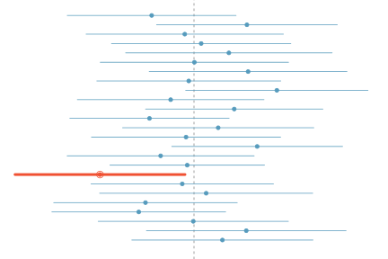

class: center, middle, title-slide

.upper-right[
```{r logo, echo = FALSE, out.width = "605px"}
knitr::include_graphics("../img/cds-101-a01-logo.png")
```
]

.lower-right[
```{r cc-by-sa, echo = FALSE, out.width = "88px"}
knitr::include_graphics("../img/cc-by-sa.png")
```

These slides are licensed under a [Creative Commons Attribution-ShareAlike 4.0 International License](http://creativecommons.org/licenses/by-sa/4.0/).
]

# Class 18: Inference and simulations IV
.title-hline[
## June 14, 2018
]

---

class: middle, center, inverse

# General

```{r setup, include = FALSE}
# DO NOT ALTER THIS CHUNK
source("../src/xaringan_setup.R")
# Load required packages
suppressPackageStartupMessages(library(tidyverse))
suppressPackageStartupMessages(library(infer))
# Set seed
set.seed(95114)
```

---

# Annoucements

.valign-slide[
* Written responses (not questions) to Reading 13 due on **June 15** by 9:00am

  * Last reading that requires you to post on Slack after completing it

* Homework 4 and extra credit Homework 5 posted, due by **11:59pm on Wednesday, June 20th**

  * Homework 4 must be submitted before you can turn in Homework 5
]

---

class: middle, center, inverse

# Final project overview

---

# Instructions for final project

.vhalign-slide[
Go to http://summer18.cds101.com/assignments/final-project/ and follow along.
]

---

class: middle, center, inverse

# Confidence intervals wrap-up

---

# What does 95% confident mean?

* Suppose we generated a series of bootstrap distributions with `infer` and found the 95% confidence interval for each one

--

* Let's also assume that, for one reason or another, we somehow knew the value of the true population mean

--

* Then, the phrase "95% confident" means that about 95% of those intervals would contain the true population mean

--

.pull-left[
* The figure shows this process with 25 samples, where 24 of the resulting confidence intervals contain the true average number of exclusive relationships, and one does not.
]

.pull-right[
```{r confidence-interval-visual, echo = FALSE, out.width = "95%"}

```
]

---

# Width of an interval

.qa[
If we want to be more certain that we capture the population parameter, i.e. increase our confidence level, should we use a wider interval or a smaller interval?
]

--

.answer[A wider interval.]

--

.qa[
Can you see any drawbacks to using a wider interval?
]

--

.footnote[
Image source (defunct): <http://web.as.uky.edu/statistics/users/earo227/misc/garfield_weather.gif>
]

```{r garfield-comic, echo = FALSE, out.width = "70%"}
knitr::include_graphics("../img/garfield.png")
```

.answer[If the interval is too wide it may not be very informative.]

--

* Commonly used confidence levels in practice are 90%, 95%, 98%, and 99%.

---

# Effect size

* We would like to know how significant a result is, not just whether or not we can reject the null hypothesis.

--

* The **effect size** measures the relative difference between two distributions.

--

* One effect size definition: [Cohen's *d*](https://en.wikipedia.org/wiki/Effect_size#Cohen.27s_d)

--
    
| Effect size | d    |
| ----------- | ---- |
| Very small  | 0.01 |
| Small       | 0.20 |
| Medium      | 0.50 |
| Large       | 0.80 |
| Very large  | 1.20 |
| Huge        | 2.00 |

--

* Guided instructions on how to use it on Homework 4!

---

# Credits

.valign-slide[
Content in **Confidence intervals wrap-up** section adapted from the chapter 4 [OpenIntro Statistics slides](https://github.com/OpenIntroOrg/openintro-statistics-slides) developed by Mine Çetinkaya-Rundel and made available under the [CC BY-SA 3.0 license](http://creativecommons.org/licenses/by-sa/3.0/us/).
]

