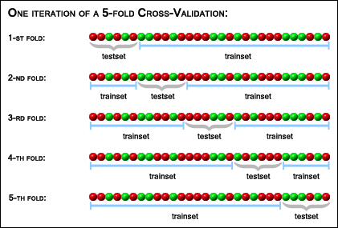

class: center, middle, title-slide

.upper-right[
```{r logo, echo = FALSE, out.width = "605px"}
knitr::include_graphics("../img/cds-101-a01-logo.png")
```
]

.lower-right[
```{r cc-by-sa, echo = FALSE, out.width = "88px"}
knitr::include_graphics("../img/cc-by-sa.png")
```

These slides are licensed under a [Creative Commons Attribution-ShareAlike 4.0 International License](http://creativecommons.org/licenses/by-sa/4.0/).
]

# Class 21: Modeling III
.title-hline[
## June 19, 2018
]

---

class: middle, center, inverse

# General

```{r setup, include = FALSE}
# DO NOT ALTER THIS CHUNK
source("../src/xaringan_setup.R")
# Load required packages
suppressPackageStartupMessages(library(tidyverse))
suppressPackageStartupMessages(library(modelr))
suppressPackageStartupMessages(library(broom))
# Load cross-validation helper script
source("../src/repeated_kfold_cross_validation.R")
# Load mariokart data set
mariokart <- read_rds("../data/mariokart.rds")
# Set seed
set.seed(931114)
```

---

# Annoucements

* Homework 4 and extra credit Homework 5 due by **11:59pm on Wednesday, June 20th**

  * Homework 4 must be submitted before you can turn in Homework 5

* **Final project due dates**

  * **Annotations first draft**: 12:00pm noon on Thursday, June 21st

  * **Peer reviews**: 6:00pm on Thursday, June 21st

  * **Annotations and final draft**: 9:00am on Friday, June 22nd
  
  * **Comparative discussion of simulations**: 10:30am on Friday, June 22nd

* **Final interviews scheduled during final exam period**: Friday, June 22nd between 10:30am and 1:15pm

---

class: middle, center, inverse

# Case study: Mario Kart eBay prices dataset

---

# Can we predict accurately eBay prices?

.footnote[
Image: *Mario Kart Wii* cover art, ©Nintendo, downloaded from Wikipedia, <https://en.wikipedia.org/wiki/File:Mario_Kart_Wii.png>
]

.pull-left[
* Data scraped from eBay listings for the video game *Mario Kart Wii*

* Can we predict each game's final selling price using other information on a eBay listing page?

### Goal

**Build a model that predicts the dataset variable `totalPr` using the other columns**
]

.pull-right[
```{r mariokart-wii-cover, echo = FALSE, out.width = "90%"}
knitr::include_graphics("../img/mario_kart_wii_cover_art.png")
```
]

---

# Last time...

* Removed outliers

.code80[
```{r mariokart-filter-outliers-select-cols}
mariokart2 <- mariokart %>%
  filter(totalPr <= 100) %>%
  select(ID, totalPr, cond, stockPhoto, duration, wheels)
```
]

--

* Split dataset 80/20 into `train` and `test`

.code80[
```{r mariokart-train-test-split}
train <- mariokart2 %>%
  sample_frac(size = 0.80, replace = FALSE)

test  <- mariokart2 %>%
  anti_join(train, by = 'ID')
```
]

--

* Built model of `totalPr` (response) using `cond` (explanatory) variable

```{r mariokart-model-cond}
mariokart_cond_model_lm <- lm(totalPr ~ cond, data = train)
```

---

# Univariate model results

--

.font90.center[
Predict training dataset and compute the residuals
]

.code80[
```{r mariokart-model-cond-predict-resid}
mariokart_cond_model_df <- train %>%
  add_predictions(mariokart_cond_model_lm) %>%
  add_residuals(mariokart_cond_model_lm)
```
]

--

.font90.center[Check if residuals are nearly normal]
.pull-left.code80[
```r
ggplot(mariokart_cond_model_df) +
  geom_qq(
    mapping = aes(sample = resid)
  ) +
  geom_qq_line(
    mapping = aes(sample = resid)
  )
```
]

.pull-right[
```{r mariokart-cond-resid-qq-plot, out.width = "100%", echo = FALSE, fig.width = 4}
ggplot(mariokart_cond_model_df) +
  geom_qq(mapping = aes(sample = resid)) +
  geom_qq_line(mapping = aes(sample = resid))
```
]

.font90.center[
Deviations from normal distribution with long tail on the right
]

---

# Plots for model evaluation

.pull-left[
.code70[
```r
ggplot(mariokart_cond_model_df) +
  geom_point(aes(pred, totalPr)) +
  geom_abline(slope = 1, intercept = 0)
```
]

```{r mariokart-cond-pred-vs-actual, out.width = "90%", fig.width = 4, fig.asp = 1.3, dpi = 175, echo = FALSE}
ggplot(mariokart_cond_model_df) +
  geom_point(aes(pred, totalPr)) +
  geom_abline(slope = 1, intercept = 0, color = "red", size = 1) +
  labs(x = "predicted", y = "observed", title = "Observed versus \npredicted values") +
  coord_fixed()
```
]

.pull-right[
.code70[
```r
ggplot(mariokart_cond_model_df) +
  geom_point(aes(pred, resid)) +
  geom_ref_line(h = 0)
```
]

```{r mariokart-cond-resid-vs-pred, out.width = "90%", fig.width = 4, fig.asp = 1.3, dpi = 175, echo = FALSE}
ggplot(mariokart_cond_model_df) +
  geom_point(aes(pred, resid)) +
  geom_ref_line(h = 0) +
  labs(x = "predicted", y = "residual", title = "Residual versus \npredicted values") +
  coord_fixed()
```
]

---

layout: false
class: middle, center, inverse

# Multivariate linear regression models

---

layout: true

# When many variables matter

---

Let's see how `cond` and `duration` affect `totalPr`:

---

count: false

Let's see how `cond` and `duration` affect `totalPr`:

.pull-left.code70[
```r
ggplot(train) +
  geom_point(aes(duration, totalPr)) +
  facet_wrap(~cond, ncol = 1)
```
]

.pull-right[
```{r mariokart-inspect-cond-duration, out.width = "95%", fig.width = 4, fig.asp = 1.3, echo = FALSE}
ggplot(train) +
  geom_point(aes(duration, totalPr), size=3, alpha=0.7) +
  facet_wrap(~cond, ncol = 1)
```
]

---

count: false

Let's see how `cond` and `duration` affect `totalPr`:

.pull-left[
.code70[
```r
ggplot(train) +
  geom_point(aes(duration, totalPr)) +
  facet_wrap(~cond, ncol = 1)
```
]

* There's a modest dependence of `duration` on `cond`, especially with new games of short duration
]

.pull-right[
```{r mariokart-inspect-cond-duration, out.width = "95%", fig.width = 4, fig.asp = 1.3, echo = FALSE}
```
]

---

count: false

Let's see how `cond` and `duration` affect `totalPr`:

.pull-left[
.code70[
```r
ggplot(train) +
  geom_point(aes(duration, totalPr)) +
  facet_wrap(~cond, ncol = 1)
```
]

* There's a modest dependence of `duration` on `cond`, especially with new games of short duration

* **If independent:** you'd see same trend in both boxes, just shifted by a constant amount 
]

.pull-right[
```{r mariokart-inspect-cond-duration, out.width = "95%", fig.width = 4, fig.asp = 1.3, echo = FALSE}
```
]

---

count: false

Let's see how `cond` and `duration` affect `totalPr`:

.pull-left[
.code70[
```r
ggplot(train) +
  geom_point(aes(duration, totalPr)) +
  facet_wrap(~cond, ncol = 1)
```
]

* There's a modest dependence of `duration` on `cond`, especially with new games of short duration

* **If independent:** you'd see same trend in both boxes, just shifted by a constant amount 

* **If interacting:** different trends in both boxes, not just a constant shift 
]

.pull-right[
```{r mariokart-inspect-cond-duration, out.width = "95%", fig.width = 4, fig.asp = 1.3, echo = FALSE}
```
]
  
---

count: false

Let's see how `cond` and `duration` affect `totalPr`:

.pull-left[
.code70[
```r
ggplot(train) +
  geom_point(aes(duration, totalPr)) +
  facet_wrap(~cond, ncol = 1)
```
]

* There's a modest dependence of `duration` on `cond`, especially with new games of short duration

* **If independent:** you'd see same trend in both boxes, just shifted by a constant amount 

* **If interacting:** different trends in both boxes, not just a constant shift 

* Modest interaction between `cond` and `duration`, keep that in mind
]

.pull-right[
```{r mariokart-inspect-cond-duration, out.width = "95%", fig.width = 4, fig.asp = 1.3, echo = FALSE}
```
]
  
---

layout: false

# Predicting price using four variables

--

* Build a linear model using the variables `cond`, `stockPhoto`, `duration`, and `wheels`

--

* Variables are independent in this model and we do not consider interaction terms like `cond * duration`.

--

```{r mariokart-multivar-model}
mariokart_multivar_model_lm <- lm(
  formula = totalPr ~ cond + stockPhoto + duration + wheels,
  data = train
)
```

--

* Predict training dataset and compute the residuals

--

```{r mariokart-multivar-model-predict-resid}
mariokart_multivar_model_df <- train %>%
  add_predictions(mariokart_multivar_model_lm) %>%
  add_residuals(mariokart_multivar_model_lm)
```

---

# Visualize the model...

* We do this just like last time, right? We can plot the model on top of a plot of the predictor variables.

--

* This would be possible...
--
 if we could create 5-dimensional images

--

* Use observed versus predicted and residual versus predicted plots like we created for the `totalPr ~ cond` model

--

.code90[
```r
ggplot(mariokart_multivar_model_df) +
  geom_point(aes(pred, totalPr)) +
  geom_abline(slope = 1, intercept = 0, color = "red", size = 1)

ggplot(mariokart_multivar_model_df) +
  geom_point(aes(pred, resid)) +
  geom_ref_line(h = 0)
```
]

---

# Multivariate model performance

.pull-left[
```{r mariokart-multivar-model-observed-vs-pred, out.width = "90%", fig.asp = 1.3, fig.width = 4, echo = FALSE}
ggplot(mariokart_multivar_model_df) +
  geom_point(aes(pred, totalPr)) +
  geom_abline(slope = 1, intercept = 0, color = "red", size = 1) +
  labs(x = "predicted", y = "observed", title = "Observed versus \npredicted values") +
  coord_fixed()
```
]

.pull-right[
```{r mariokart-multivar-model-resid-vs-pred, out.width = "90%", fig.asp = 1.0, fig.width = 4, echo = FALSE}
ggplot(mariokart_multivar_model_df) +
  geom_point(aes(pred, resid)) +
  geom_ref_line(h = 0) +
  labs(x = "predicted", y = "residual", title = "Residual versus \npredicted values") +
  coord_fixed()
```
]

---

# Inspect multivariate model residuals 

.pull-left[
.code60[
```r
ggplot(mariokart_multivar_model_df) +
  geom_histogram(mapping = aes(x = resid),
                 binwidth = 1, center = 0)
```
]

```{r mariokart-multivar-model-resid-histogram, echo = FALSE, fig.asp = 0.8, out.width = "90%"}
ggplot(mariokart_multivar_model_df) +
  geom_histogram(mapping = aes(x = resid), binwidth = 1, center = 0)
```
]

.pull-right[
.code60[
```r
ggplot(mariokart_multivar_model_df) +
  geom_qq(mapping = aes(sample = resid)) +
  geom_qq_line(mapping = aes(sample = resid))
```
]

```{r mariokart-multivar-model-resid-qq-plot, echo = FALSE, fig.asp = 0.8, out.width = "90%"}
ggplot(mariokart_multivar_model_df) +
  geom_qq(mapping = aes(sample = resid)) +
  geom_qq_line(mapping = aes(sample = resid))
```
]

--

* Residuals still show deviations from the normal distribution on the right-side tail, but they're smaller overall

---

# Comparing the two models

* Compare the residual histograms of the two models

--

.code80[
```r
data_frame(
  model = combine(
    rep("cond", nrow(mariokart_cond_model_df)),
    rep(
      "cond + stockPhoto + duration + wheels",
      nrow(mariokart_multivar_model_df)
    )
  ),
  resid = combine(
    pull(mariokart_cond_model_df, "resid"),
    pull(mariokart_multivar_model_df, "resid")
  )
) %>%
  ggplot() +
  geom_histogram(
    mapping = aes(x = resid, fill = model), alpha = 0.5, binwidth = 1,
    position = "identity", center = 0
  ) +
  theme(legend.position = "bottom")
```
]

---

count: false

# Comparing the two models

* Compare the residual histograms of the two models

```{r mariokart-compare-two-lm-resid, echo = FALSE, fig.asp = 0.7}
data_frame(
  model = combine(
    rep("cond", nrow(mariokart_cond_model_df)),
    rep("cond + stockPhoto + duration + wheels", nrow(mariokart_multivar_model_df))
  ),
  resid = combine(
    pull(mariokart_cond_model_df, "resid"),
    pull(mariokart_multivar_model_df, "resid")
  )
) %>%
  ggplot() +
  geom_histogram(
    mapping = aes(x = resid, fill = model), alpha = 0.5, binwidth = 1,
    position = "identity", center = 0
  ) +
  theme(legend.position = "bottom")
```

--

* Multivariate model *seems* better
--
, but it'd be better if we had an objective measure of model quality

---

class: middle, center, inverse

# Model selection

---

# Question, what kind of model is best?

* Comparing residuals can help us understand the relative performance of models
--
, but it's just a qualitative measure

--

* How should we compare and rank models?

--

* This is what model selection is about, computing scores and measures of model performance for different models, and selecting the best choice.

--

* Bootstrapping is one option

--

* Cross-validation is another method that can compare relative model performance using only training data 

--

* A popular flavor of cross-validation (especially among data scientists) is called **k-fold cross-validation**

--

* **Basic idea:** Estimate how robust your model is by systematically removing different chunks (the "folds") of the dataset, repeating the fitting process, then testing its predictive power on the folds

---

layout: true

# k-fold cross-validation

.footnote[
.font90[Image: ["Cross-Validation Explained"](https://genome.tugraz.at/proclassify/help/pages/XV.html), *ProClassify User's Guide*, <http://genome.tugraz.at/proclassify/help/pages/images/xv_folds.gif>]
]

---

```{r cross-validation-schematic2, echo = FALSE, out.width = "45%"}

```

---

count: false

```{r cross-validation-schematic2, echo = FALSE, out.width = "45%"}
```

.font90[
* The above example illustrates a *5-fold*, or $k = 5$, cross-validation.
]

---

count: false

```{r cross-validation-schematic2, echo = FALSE, out.width = "45%"}
```

.font90[
* The above example illustrates a *5-fold*, or $k = 5$, cross-validation.

* Each fold will act as a testing set, with the remaining $k - 1$ folds used to train the model.
]

---

count: false

```{r cross-validation-schematic2, echo = FALSE, out.width = "45%"}
```

.font90[
* The above example illustrates a *5-fold*, or $k = 5$, cross-validation.

* Each fold will act as a testing set, with the remaining $k - 1$ folds used to train the model.

* Fit model, predict values in testing set, then calculate the mean-squared prediction error (MSE)
]

---

count: false

```{r cross-validation-schematic2, echo = FALSE, out.width = "45%"}
```

.font90[
* The above example illustrates a *5-fold*, or $k = 5$, cross-validation.

* Each fold will act as a testing set, with the remaining $k - 1$ folds used to train the model.

* Fit model, predict values in testing set, then calculate the mean-squared prediction error (MSE)

* MSE gives an estimate of how well the model works as a predictor
]

---

count: false

```{r cross-validation-schematic2, echo = FALSE, out.width = "45%"}
```

.font90[
* The above example illustrates a *5-fold*, or $k = 5$, cross-validation.

* Each fold will act as a testing set, with the remaining $k - 1$ folds used to train the model.

* Fit model, predict values in testing set, then calculate the mean-squared prediction error (MSE)

* MSE gives an estimate of how well the model works as a predictor

* MSE is general-purpose and allows you to compare models of many types
]

---

layout: false

# Cross-validating our models

--

* The code for doing k-fold cross-validation, even with the `tidyverse` tools, is *just* complicated enough that it's beyond the scope of the course

--

* To let you practice model selection, run the following code to load in the function `rep_kfold_cv()`

.code70[
```r
source("http://summer18.cds101.com/files/R/repeated_kfold_cross_validation.R")
```
]

--

* This function takes a linear regression model and cross-validates it automatically for you, you just supply the following inputs:

| Input   | Description                                                               |
| ---     | ----------                                                                |
| data    | The training dataset                                                      |
| k       | Number of folds to use                                                    |
| model   | Model to cross-validate written in `lm()` syntax                          |
| cv_reps | Number of times to repeat cross-validation sequence to improve statistics |

---

# Applying cross-validation to our models

* Cross-validate the univariate model `totalPr ~ cond`

--

.code80[
```r
rep_kfold_cv(data = train, k = 10, model = totalPr ~ cond, cv_reps = 3)
```
]

--

```{r mariokart-cv-univariate-cond, eval = TRUE, echo = FALSE}
univariate_kfold_results <- rep_kfold_cv(
  data = train,
  model = totalPr ~ cond,
  k = 10,
  cv_reps = 3
)
univariate_kfold_results %>%
  knitr::kable(format = "html")
```

--

* Cross-validate the multivariate model `totalPr ~ cond + stockPhoto + duration + wheels`

--

.code80[
```r
rep_kfold_cv(
  data = train, k = 10,
  model = totalPr ~ cond + stockPhoto + duration + wheels, cv_reps = 3
)
```
]

--

```{r mariokart-cv-multivariate-cond-photo-duration-wheels, eval = TRUE, echo = FALSE}
multivariate_all_results <- rep_kfold_cv(
  data = train,
  k = 10,
  model = totalPr ~ cond + stockPhoto + duration + wheels,
  cv_reps = 3
)
multivariate_all_results %>%
  knitr::kable(format = "html")
```

--

.answer[Scores indicate the multivariate model performs better than the univariate model]

---

class: middle, center, inverse

# Model selection activity

---

# Find the best model!

.pull-left.font80.code80[
* Use `rep_kfold_cv()` to test the different additive models we can build using the `cond`, `duration`, `stockPhoto`, and `wheels` columns.

* 15 permutations in all

* According to the adjusted mean-squared error (mse), which model should we select?

* Once we've selected a model, fit it to the full training dataset, then check the mean-squared error for its predictions on the `test` data:

  ```r
  lm(totalPr ~ cond, data = train) %>%
      mse(test)
  ```
]

.pull-right.font80[
```{r model-permutations, echo = FALSE}
data_frame(
  cond = combine(as.character(NA), "✗"),
  duration = combine(as.character(NA), "✗"),
  stockPhoto = combine(as.character(NA), "✗"),
  wheels = combine(as.character(NA), "✗"),
) %>%
  expand(cond, duration, stockPhoto, wheels) %>%
  filter(
    !(is.na(cond) & is.na(duration) & is.na(stockPhoto) & is.na(wheels))
  ) %>%
  arrange(cond, !is.na(duration), !is.na(stockPhoto), !is.na(wheels)) %>%
  mutate_all(funs(if_else(is.na(.), " ", .))) %>%
  mutate(`model` = row_number(), `adj_mse` = rep(" ", n())) %>%
  select(`model`, everything()) %>%
  mutate(
    adj_mse = if_else(
      condition = (cond == "✗" & duration == " " & stockPhoto == " " & wheels == " "),
      true = as.character(round(pull(univariate_kfold_results, adjusted_mse), 1)),
      false = adj_mse
    ),
    adj_mse = if_else(
      condition = (cond == "✗" & duration == "✗" & stockPhoto == "✗" & wheels == "✗"),
      true = as.character(round(pull(multivariate_all_results, adjusted_mse), 1)),
      false = adj_mse
    ),
  ) %>%
  knitr::kable(format = "html", align = "c")
```
]

---

# Credits

.valign-slide[
**Mario Kart data set source:** David M Diez, Christopher D Barr, and Mine Çetinkaya-Rundel. 2012. *openintro*: OpenIntro data sets and supplemental functions. <http://cran.r-project.org/web/packages/openintro>

Mario Kart example loosely adapted from content in chapters 6.1, 6.2, and 6.3 of the [*Introductory Statistics with Randomization and Simulation*](https://www.openintro.org/stat/textbook.php?stat_book=isrs) textbook by David M Diez, Christopher D Barr, and Mine Çetinkaya-Rundel and made available under the [CC BY-NC-SA 3.0 Unported license](http://spring18.cds101.com/doc/isrs_license.txt).
]
